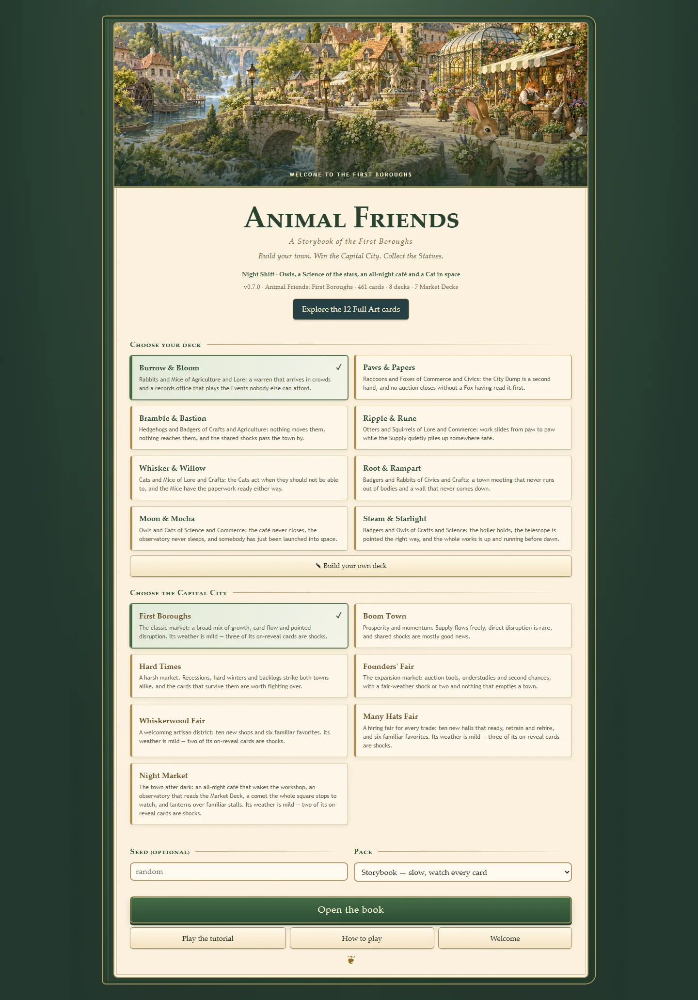
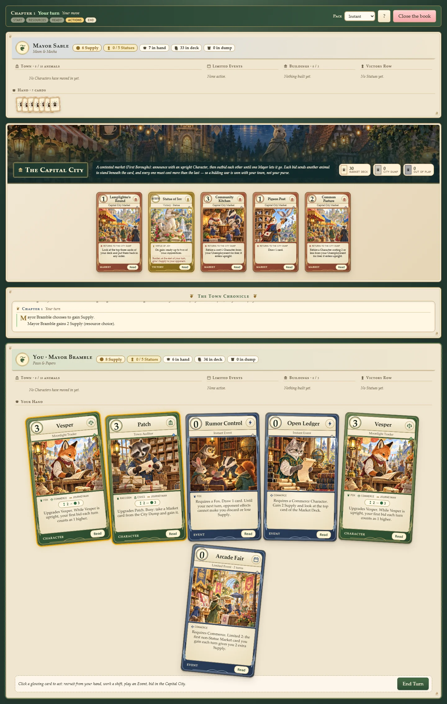

# Painted app surroundings

The non-card interface now shares the cards' painted borough setting, forest greens, parchment and antique gold. Card assets, card styling and game rules are unchanged.

## Assets
Generated with the built-in image-generation tool, then encoded as WebP (quality 86) without resizing:
- `assets/ui/borough-daylight.webp` — 1536 × 1024, 552,560 bytes. Menu cover, welcome screen and workshop header.
- `assets/ui/capital-twilight.webp` — 1536 × 1024, 458,062 bytes. Capital City banner and victory overlay.
- `assets/ui/open-storybook-table.png` — 1536 × 1024. A blank open storybook used behind the live, accessible Book, rules and welcome UI.

`src/ui/surroundings.css` owns only surrounding interface styles. Both images are local, decorative, and have solid-color fallbacks; no image contains functional text. The cover reserves its height before loading. Existing selection semantics, focus indicators and reduced-motion rules are preserved.

## Generation prompts

### Daylight borough
Use case: illustration-story. Asset type: wide landscape illustration for Animal Friends TCG main menu, 1536x1024. Primary request: a beautifully painted storybook animal borough, matching lush traditional gouache and watercolor trading card illustrations, fine warm ink details, botanical ornament, golden afternoon sunlight. View along a winding cobblestone path crossing a little stone bridge toward cozy timber shops, greenhouse, clock tower and distant hill village. Small clothed rabbit gardener and mouse carrying books in foreground at lower right, fox merchant near stall, believable charming proportions. Rich moss and sage green foliage, buttercream architecture, antique gold, muted terracotta rooftops; sophisticated illustrated picture book, intricate but calm. Composition: panoramic landscape with town centered, leafy branches framing upper corners, flowers at lower edges, generous clear sky in upper third; scene must crop well to a wide 3:1 banner. No text, lettering, logos, frames, card borders or interface. This is surrounding app artwork, not a card.

### Twilight capital
Use case: illustration-story. Asset type: wide landscape background banner for the Capital City area of Animal Friends TCG, 1536x1024. Paint a cozy woodland animal town square at blue hour, elegant storybook gouache and watercolor with delicate ink detail. A luminous ornate brass clock tower, ivy-covered timber shops, a small observatory dome, warm lit cafe windows and strings of tiny amber lanterns above cobblestones. A stone rabbit monument with flowers in the middle distance. A tiny owl astronomer and cat cafe keeper near the edges. Botanical leaves frame corners. Deep desaturated forest teal, indigo, antique gold, warm cream light, terracotta roofs. Rich handcrafted painting, atmospheric and gentle, matching collectible storybook cards. Composition: wide establishing view, main architectural detail arranged across middle horizontal third for a shallow banner crop, quiet lower foreground. No text, lettering, logos, card borders, frames or UI. Entire image is a single cohesive landscape.

### Open storybook table

Use case: stylized-concept. Asset type: reusable game UI background for an open-book overlay. A beautifully crafted open storybook viewed almost straight from above, resting on dark forest-green felt and a warm walnut tabletop. Two broad blank parchment pages with a subtle centre gutter, gently curled edges, stitched green leather binding, antique brass corners, tiny pressed leaves and acorns near the outside. Premium hand-painted gouache and watercolor with warm ink detail. Wide composition, clean spacious page interiors for live interface content. Warm amber lamplight; ivory, forest green, walnut and antique gold. No text, symbols, logos, characters, cards or watermark.

`src/ui/polish.css` adds the unified felt tabletop, tactile controls, literal open-book collection and dialogs, improved panel depth, responsive layouts and reduced-motion fallbacks. `src/ui/polish.js` supplies the lightweight pointer ripple used by controls; gameplay choreography remains in `fx.js` and `choreo.js`.

## One material: the card

Everything the interface is built out of is cut from the card's own stock, so a panel, a button and a
card read as the same object at three sizes. `src/ui/polish.css` names the material once, as custom
properties — `--ui-card-edge`, `--ui-card-trim`, `--ui-card-radius`, `--ui-card-frame`,
`--ui-card-paper` — and every box in the game (menu fields, mode cards, deck cards, dialogs, the
Mayors' shelf, the Post Office, the Lore Directory's rows and tiles) is drawn with them: a doubled
gold edge, an ivory frame inside it, printed paper, and corners that are round on one diagonal and
clipped on the other, exactly as `storybook.css` cuts a card face.

A button is a small card and behaves like one: it lifts, turns half a degree and opens a shadow
under itself when a hand comes near, and settles flat when it is pressed. Anything a Mayor can pick
up — a deck, a Mayor, an unfinished game, a character tile, a chapter — is picked up the same way.
`prefers-reduced-motion` drops every one of those transforms.

## The painted page rectangles

Three screens are laid out on the same painting, `assets/ui/open-storybook-table.png`: the Book, the
Lore Directory, and the Welcome and How-to-play spreads. `src/ui/book.css` publishes where the paper
actually is — `--page-l-x/y/w/h` and `--page-r-x/y/w/h`, measured off the painting — and the other
three read them instead of guessing a margin, so nothing ever prints on the spine, the gilt corners
or the table.

The Lore Directory is a real spread because of it: the left page carries the title, the tabs, the
search and the contents (the chapter list, the species and study filters, or the two settings), and
the right page is the reading page. Each scrolls inside its own paper and fades at the foot. Below
760px the two fold back into one column.

## The Book's card entry

Clicking a card in the Book opens it as a catalogue entry rather than an enlarged picture: the card
at reading size, its cost, species, study, rarity and printing, its rules text and its flavour, every
printing it was painted in (turning one over swaps the face where it stands, and the page agrees
afterwards), and doors into everything it is tied to — the character's entry in the Lore Directory,
every chapter or place that prints this card, and the other cards those name. Each door opens the
next entry in the same reader, so a Mayor can walk the collection without going back to the shelf.

## Validation
- 423 existing tests passed.
- Full-game smoke run completed: winner at turn 67.
- Chromium at 1440, 768 and 390 px: menu, deck workshop and game inspected; no document overflow, HTTP failures or page errors.
- Keyboard deck selection, opening-hand confirmation, Supply choice, and card-reader Escape dismissal passed at all three sizes.
- Native screen-reader testing was not run.

