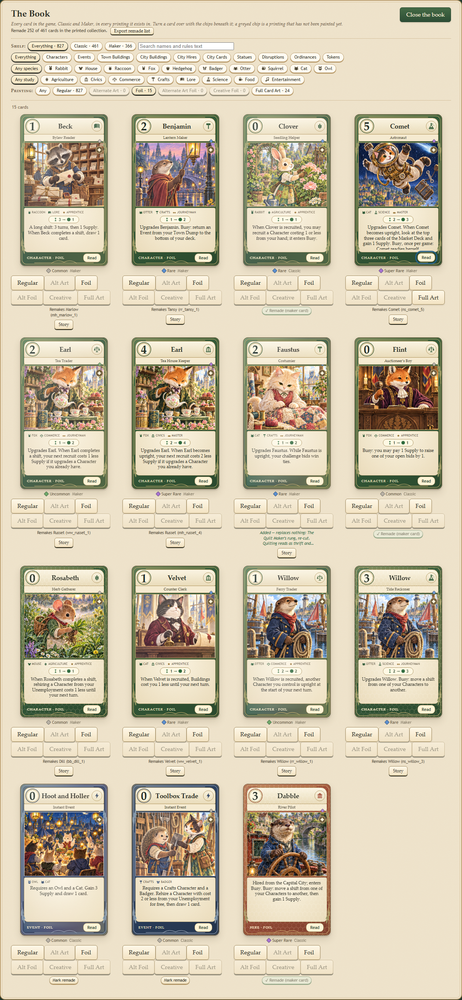

# First foil printings

The first release drew fifteen distinct cards, each of the five finishes appearing exactly three
times. Every selection is an
ordinary **Foil** printing (`foil`), including hexagons and masked details; none is Creative Foil
or Alternate Art Foil. Regular and Full Card Art printings keep their existing appearance.
Fourteen hexagon Foil printings were [added afterwards](#hexagon-foil-printings-added-later), and
thirty-five more were [chosen rather than drawn](SECOND_FOILS.md), for 64 foils in all.

| Card | Card ID | Foil finish |
| --- | --- | --- |
| Beck — Bylaw Reader | `mk_beck_bylaw_reader_1` | Full card |
| Clover — Seedling Helper | `mk_clover_seedling_helper_0` | Full card |
| Earl — Tea Trader | `mk_earl_tea_trader_2` | Full card |
| Benjamin — Lantern Maker | `mk_benjamin_lantern_maker_2` | Artwork only |
| Velvet — Counter Clerk | `mk_velvet_counter_clerk_1` | Artwork only |
| Moss's Rehiring Day | `mk_moss_rehiring_day` | Artwork only |
| Comet — Astronaut | `mk_comet_astronaut_5` | Artwork details |
| Finn — Auctioneer’s Boy | `mk_finn_auctioneers_boy_0` | Artwork details |
| Earl — Tea House Keeper | `mk_earl_tea_house_keeper_4` | Artwork details |
| The Night Round | `mk_night_round` | Reverse |
| Willow — Ferry Trader | `mk_willow_ferry_trader_1` | Reverse |
| Faustus — Costumier | `mk_faustus_costumier_2` | Reverse |
| Dylan — River Otter | `mk_dylan_river_otter_4` | Hexagon pattern |
| Willow — Tide Reckoner | `mk_willow_tide_reckoner_3` | Hexagon pattern |
| Rosabeth — Herb Gatherer | `mk_rosabeth_herb_gatherer_0` | Hexagon pattern |

The finishes were drawn with a randomly generated 32-bit seed, **3461026837**, and a Fisher–Yates
shuffle with Mulberry32 over the unique IDs sorted alphabetically; the first 15 draws were assigned in
groups of three to full, artwork, details, reverse and hexagon. Five of those fifteen named cards the
collection has since replaced, and in each case the foil stayed with the card that took its place, so
the finish counts are unchanged; the three detail masks were retraced to the new paintings. The list
is recorded in
[FOIL_SELECTION.json](FOIL_SELECTION.json); it is fixed at authoring time, never rerolled in-game.

## Detail masks

Each mask is traced to the ordinary printing's square artwork, not its full-art portrait. All three
were [retraced](SECOND_FOILS.md#the-three-older-masks-were-retraced) after their paintings were
replaced, and now read:

- **Comet — Astronaut:** brass helmet rim, chest gauge and the comet in the sky.
- **Finn — Auctioneer’s Boy:** the two lantern flames and the brass candlesticks on the block.
- **Earl — Tea House Keeper:** the porcelain teapot and cups, and the brass lantern in front of them.

The transparent SVG masks live in `assets/art/foil-masks/`. The paintings themselves are unchanged.
If one of these ordinary paintings is replaced later, retrace its mask to the new details.

## Hexagon Foil printings added later

Fourteen more cards were given an ordinary **Foil** printing with the hexagon finish, outside the
recorded draw. Each uses its existing ordinary artwork, so no new painting or mask was needed, and
the draw above is unchanged. Where a character's requested card already held a drawn foil, the
hexagon went to another card of theirs that had none: Beck — Ward Clerk stands in for Bylaw Reader,
and Benjamin — Master Lantern Maker for Lantern Maker.

| Card | Card ID |
| --- | --- |
| Adam — Road Mender | `mk_adam_road_mender_1` |
| Bean — The Early Shift | `mk_bean_the_early_shift_4` |
| Beck — Ward Clerk | `mk_beck_ward_clerk_2` |
| Benjamin — Master Lantern Maker | `mk_benjamin_master_lantern_maker_4` |
| Berry — Clockmaker | `mk_berry_clockmaker_1` |
| Cassadee — Hall Manager | `mk_cassadee_hall_manager_3` |
| Cookie — Winter Stores Cook | `mk_cookie_winter_stores_cook_3` |
| Copper — Cellar Keeper | `mk_copper_cellar_keeper_4` |
| Daniel — Star Charter | `mk_daniel_star_charter_3` |
| Faustus — Bolt Boy | `mk_faustus_bolt_boy_0` |
| Finn — Peddler | `mk_finn_peddler_1` |
| Harrison — Piano Boy | `mk_harrison_piano_boy_0` |
| Hazel — Guildmaster | `mk_hazel_guildmaster_3` |
| Lindsay — Potting Helper | `mk_lindsay_potting_helper_0` |

Thirty-five more foils were [chosen, not drawn](SECOND_FOILS.md), for 64 in all.
Open **The Book** and select the **Foil** printing to see them.
Every card also retains its Regular printing. The [finish preview](../src/ui/foil-preview.html)
can compare effects, while the Book shows the actual assigned finish.

