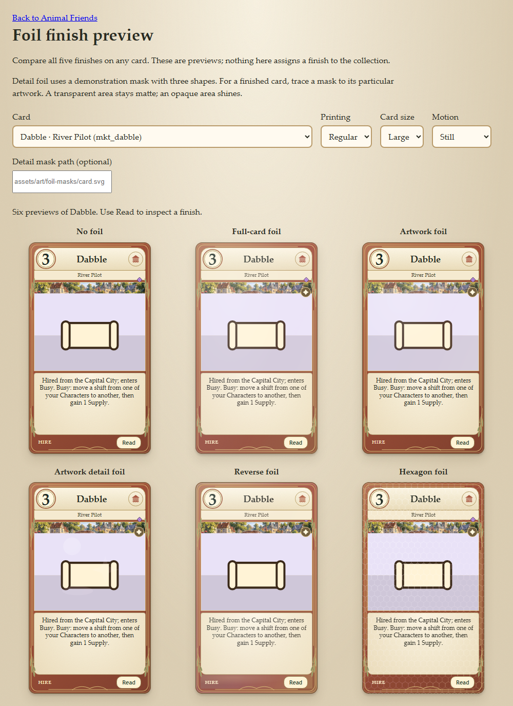
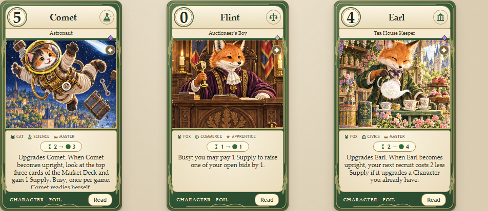

# Foil finishes

Foil is a presentation setting, independent of rarity, card type, rules and artwork printing.
Any card (including Maker cards, Tokens, Events and Capital City cards) can use any finish.
The [first foil release](FIRST_FOILS.md) assigns 15 ordinary Foil printings, three per finish, and
14 hexagon Foil printings were added after it. A [second, chosen set](SECOND_FOILS.md) adds 35 more
— artwork foil for ten of the cutest cards, reverse foil for ten of the coolest, full-card foil for
ten of the most underrated, and five new detail masks — for 64 ordinary Foil printings in all.
Existing foil flags and printing defaults are
preserved, including the existing full-art foil default; an explicit `false` makes any of them matte.

Run `npm run serve`, then open [the finish preview](../src/ui/foil-preview.html). Pick any card and
available printing to compare matte, full, artwork, details, reverse and hexagon treatments. The
preview does not save or publish selections. Its Read buttons preserve the selected finish.



## Assigning finishes over time

`FOIL_ASSIGNMENTS` in `src/ui/foil.js` is the presentation-only registry, keyed first by exact card
ID and then by printing key from `src/ui/versions.js`. For example:

```js
export const FOIL_ASSIGNMENTS = Object.freeze({
  bb_clover_3: {
    regular: 'artwork',
    fullCardArt: { mode: 'details', mask: 'assets/art/foil-masks/clover-full.svg' },
  },
  mk_peanut_barista_1: { regular: 'hexagon', fullCardArt: false },
});
```

These are examples, not assigned finishes. An entry decorates an existing printing; it does not
create an alternate painting or add a new printing to the Book.

To introduce a separately listed foil printing, also opt it into `PRINTINGS` in `versions.js`
(e.g. `card_id: { foil: true }`) and assign its finish under the `foil` key. It can use the existing
ordinary artwork; the fourteen later hexagon Foil printings and the thirty-five chosen ones were all
added this way.

| Value | Coverage |
| --- | --- |
| `false` or `null` | No foil, even when the printing normally has it |
| `'full'` | Entire face, including artwork, panels and frame |
| `'artwork'` | Only the artwork container; full art stays underneath the printed panels |
| `{ mode: 'details', mask: 'assets/…' }` | Only opaque parts of an artwork-specific alpha mask |
| `'reverse'` | Stock, printed panels and border; artwork stays matte |
| `'hexagon'` | Repeating small hexagon outlines across the entire face |

Resolution order: explicit `buildCardFace(def, { foil: … })` preview override, exact registry entry,
legacy `def.foil`, then the printing default. `true` / `'plain'` map to full foil and `'creative'`
maps to hexagon foil. Unknown values fail closed. No finish modifies a definition or game state.

## Authoring a detail mask

Save a transparent PNG or standalone SVG alongside the artwork, with opaque regions traced to the
details that should shine. **Alpha controls coverage**: black opaque pixels shine too; use actual
transparency for areas that stay matte. Semitransparent edges soften the transition. Do not embed
scripts, external resources or the card's rules in the mask.

Trace it against the painting the printing actually shows: a mask authored for a scene that is
later replaced keeps animating, over the wrong part of the card, and no check will fail.
Match the coordinate space/aspect ratio of the rendered outer artwork SVG: regular atlas and alternate
art use `100 × 100`, full-card art uses `100 × 160`. For a vector-only scene, match that scene's viewBox.
The mask uses centered `cover`, matching the renderer's `xMidYMid slice`, so it follows the same crop
on table cards, large cards and taller readers. Use a separate mask for each different painting.
Full-art masks cover the full background; the printed panels sit above the foil.

Paths are relative to the site root and remain within the bundled site, including a GitHub Pages
repository prefix. A missing/invalid mask configuration disables the finish. A file that fails to
load remains transparent under CSS masking; it never becomes whole-art foil. The preview includes
a three-shape demonstration mask, **not a finished mask for any card**, and accepts a bundled mask
path to check real artwork alignment before assigning it.

## Rendering and checks

`foil.css` owns the effect; older blanket and creative foil styles have been removed. Layers are
anchored to actual card regions, without measured art-window heights or per-card observers. Reverse
foil on full art covers panels and the border because all exposed background is artwork. Hexagons
use a bundled seamless SVG mask. Foil layers are noninteractive and hidden from assistive technology.
The selected finish is retained in the reader and hover peek. Motion stops for reduced-motion
preferences and the Instant pace, leaving a still foil finish.

All finishes combine saturated spectral color with a sweeping white/cyan reflection. Full-face
coverage uses a restrained blend to preserve text; masked details use a brighter color-dodge finish
and a four-second light sweep so small metal and porcelain accents visibly gleam. Read dialogs also
track pointer light, while passive hover previews and animation clones remain noninteractive.



`npm test` covers finish normalization, assignment precedence, every card/printing combination,
mask validation, coverage placement and unchanged card definitions, alongside engine regressions.
Use the preview for visual checks at table/large sizes, full art, narrow viewports and Read dialogs.

For the optional Chromium pixel regression check, install `playwright` and `pngjs` locally
(`npm install --no-save --package-lock=false playwright pngjs`, then `npx playwright install chromium`).
With the server running, run `node scripts/check-foil.cjs http://localhost:8080`.
This checks actual coverage pixels on ordinary and full-art cards, the Read dialog, motion settings,
phone/tablet/desktop overflow and the main app loading without browser errors. Full-art panels are
translucent: artwork foil stays behind them, but a little background shine can show through.
It also compares two animation phases on assigned detail masks at table and large sizes, checking
that reflected light visibly changes rather than merely verifying that a mask exists. What it cannot
check is whether a mask still lands on the details it was traced for; that is an authoring
responsibility, and the preview is where to confirm it.
Native screen-reader testing is not automated here.
