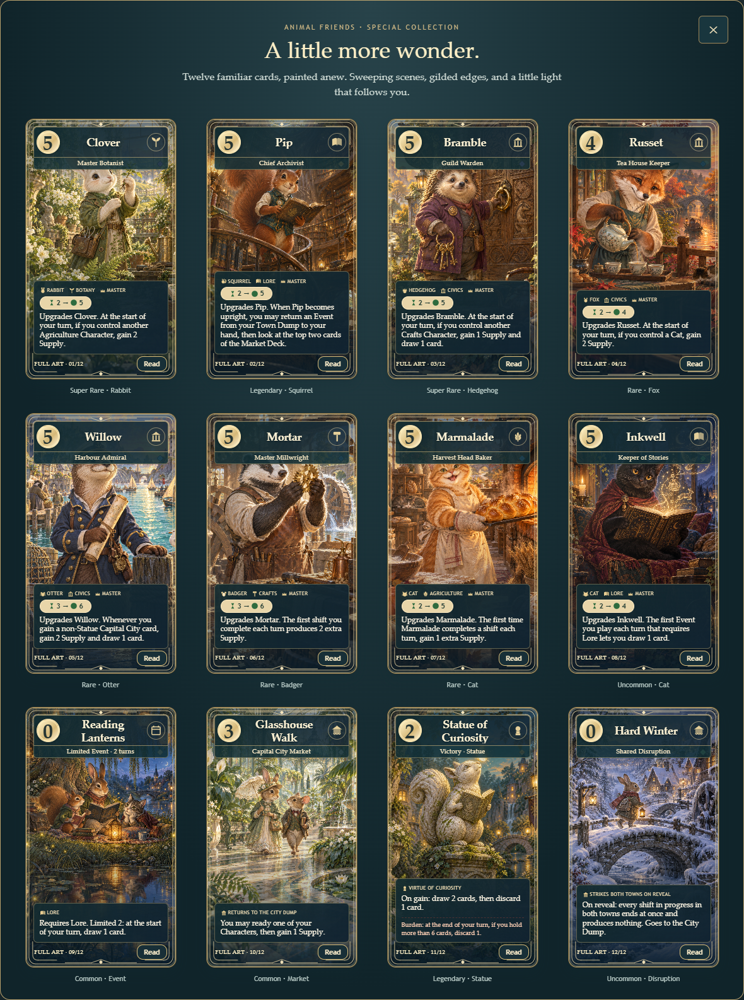

# Full Art Collection

Twelve existing cards get an intentionally distinct collectible presentation: individual 1024 × 1536
paintings extending across the entire face, deep translucent nameplates and rules panels, fine gold
corner work, and a soft pearlescent sheen. The restrained highlight follows the pointer and also
responds to keyboard focus. There is no continuous shimmer animation; reduced motion disables transitions.

Open **Explore the 12 Full Art cards** on the book cover. Each gallery card has a **Read** button for
the complete rules, burden and flavor text. The same shared renderer covers the game table, hand,
Deck Workshop, previews and animation copies. Escape dismisses the reader or gallery and restores focus.

| No. | Card | Printed rarity | Art direction |
| --- | --- | --- | --- |
| 01 | Clover — Master Botanist | Super Rare | A flowering cutting in a sunlit greenhouse |
| 02 | Pip — Chief Archivist | Legendary | A spiral library carved inside an ancient tree |
| 03 | Bramble — Guild Warden | Super Rare | Brass keys at the carved guild door |
| 04 | Russet — Tea House Keeper | Rare | Tea pouring above an autumn canal |
| 05 | Willow — Harbour Admiral | Rare | A bright harbor, sailboats and a rolled chart |
| 06 | Mortar — Master Millwright | Rare | Brass gears in a working watermill |
| 07 | Marmalade — Harvest Head Baker | Rare | A golden harvest loaf beside a warm oven |
| 08 | Inkwell — Keeper of Stories | Uncommon | A book glowing with imagined constellations |
| 09 | Reading Lanterns | Common | Three friends reading by a lantern-lit pond |
| 10 | Glasshouse Walk | Common | Lush glass arches and sunlit mosaic paths |
| 11 | Statue of Curiosity | Legendary | A stone squirrel discovering a luminous butterfly |
| 12 | Hard Winter | Uncommon | Snowbound cottages and a frozen mill |

These subjects were selected for recognizable characters, expressive occupations, varied environments,
and strong lighting opportunities across all five card types. Their printed rarities, card IDs, costs,
abilities, deck limits and rules are unchanged. Other versions of the same named Character keep their
regular art. This is a fixed presentation selection, not a new rarity or random reward system.

## Assets and implementation

- `src/ui/full-art.js` owns the exact twelve-card registry, collection numbers and bundled image URLs.
- `src/ui/full-art.css` styles only opted-in faces plus the collection gallery.
- `src/ui/full-art-gallery.js` builds the gallery from the existing card definitions and shared renderer.
- `assets/art/full-art/<card-id>.png` contains all twelve original portraits.
- Original atlas art and per-card vector art remain underneath each new painting as failure fallbacks.
- [Exact generation prompts](FULL_ART_PROMPTS.md); created with the built-in image generation tool.

## Validation

- All 166 automated tests pass, including unique assets, exact selection and unchanged definitions.
- Full-game smoke run completed with a winner.
- Chromium/Edge browser checks at 1360, 768 and 390 px: all twelve readers (36 combinations), complete
  rules/burden/flavor, gallery width, Escape, focus restoration and reduced motion passed.
- No JavaScript page errors or failed asset requests during those browser checks.
- Deck Workshop shows exactly nine selected player cards alongside the regular catalogue; its reader
  works and a seeded game starts successfully.
- Visually inspected every painting, the rendered collection and the phone-sized Statue reader.
- Native screen-reader testing was not run.

