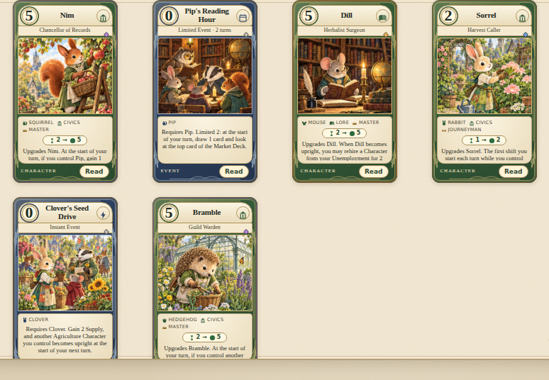

# Many Hats — v0.4.0

Many Hats adds **72 cards** for **332 cards** in all, and every one of them is about a Character the book
already knew. Nobody new moves to town: instead all **38 named Characters** take up a new trade or a new
level, cards arrive that ask for a particular friend by name, and neighbors who have shared a deck for
three editions finally start working together. The nine species, six studies, nine Statues and all
earlier decks and Market Decks are preserved; no earlier card's rules text changed.

## Content

| Addition | Count |
| --- | ---: |
| New versions of existing Characters (one for every name, and a full three-level line for Linnet, Mortar, Nib, Nutmeg, Pebble and Russet) | 44 |
| Events, of which ten support one named Character and eight support a study or a species pair (15 Instant, 3 Limited) | 18 |
| Market cards | 10 |
| New 30-card starter decks | 2 |
| New Market Deck | 1 |

### New hats

Most new versions move a Character into an area of study none of their earlier versions held: Acorn the
bidder becomes a farmhand, Juniper the diplomat picks up a hammer, Dill the herb girl becomes a surgeon, and
Mabel the seed keeper ends up directing the whole seed bank. The 44 new versions are spread across ranks:
ten Apprentices (cost 0–1), fifteen Journeymen (2–3) and nineteen Masters (4–5), so an existing line can be
started earlier (Acorn now has a cost-0 version below her cost-2 Stall Runner) or extended upward. Every
version of a name still has a distinct cost, so any cheaper version upgrades into any dearer one.

### Friends by name

Two small additions to the card vocabulary make character-specific cards possible:

- A filter or condition may name a Character: `{ "otherCharacterInTown": { "name": "Pip" } }`. It matches
  whichever version of that Character is on top of a stack, so Nim, Chancellor of Records pays out for a
  Story Collector or a Chief Archivist alike.
- An Event requirement may name a Character: `{ "name": "Clover" }`. Only an upright Clover can pay it.
  The Deck Workshop lists such an Event under that Character's species and studies.

Nine new versions name a friend: Nim → Pip, Flint → Juniper, Sorrel → Clover, Burr → Bramble, Hazel → Patch,
Brook → Willow, Tansy → Vesper, Pippa → Marmalade and Dill → Fern. Ten Events require a named Character
(Pip, Clover, Hazel, Marlow, Thistle, Inkwell, Acorn, Velvet, Moss and Poppy), five support a study or a
study pair, and three pair species that had never shared an Event: Hedgehog and Mouse, Fox and Cat,
Raccoon and Badger.

### Decks and market

**Hedge & Harvest** (Hedgehog, Rabbit, Badger; Agriculture, Crafts, Lore) is built on its named pairs: Burr
sweeps for Bramble, Sorrel calls for Clover, and Thistle's Grange Supper feeds the whole row. **Tales & Tolls**
(Squirrel, Otter, Fox; Lore, Commerce, Civics) runs Pip's stories through Nim's records, Brook's barges
through Willow's ferry, and Tansy's lanterns ahead of Vesper. Each has 18 Characters and 12 Events, with
copy counts checked against computed rarity.

**Many Hats Fair** is a hiring fair: ten new halls that ready, retrain and rehire Characters by rank
(Apprentice Fair, Journeyman's Road, Masters' Lodge, Promotion Board), six familiar favorites, all nine
Statues and no Disruptions, at the usual 25-card size.

## Artwork and interface

No new paintings were generated. Every Many Hats card names an existing painting outright with
`art: { atlas: "boroughs" | "whiskerwood", tile }`, which `src/ui/painted-art.js` now resolves for both
bundled atlases (the original set's species-and-theme selection is unchanged). A new version keeps its
Character's portrait, the Whiskerwood neighbors keep theirs, and Events and Market cards borrow the scene
that fits them best: Pip's Reading Hour reads in the civic library, Clover's Seed Drive at the seed
exchange, the Masters' Lodge beneath the Town Clock. Card faces, the Read view and the Deck Workshop print
a named requirement as the Character's name with their species icon.

The cover previews Clover, Pip and Marmalade and announces the expansion. The heuristic opponent also
gained a general rule for Busy abilities it has no special case for (plain gains, draws and peeks are
weighed against the shift the Character would otherwise start), so new cards such as Vesper, Moonlight
Trader and Linnet, Master Printer are actually used in AI play.



## Rarity and tooling

Rarity is still computed, never chosen: `node scripts/stamp.mjs` (new) restamps every card's `rarity` and
`power` from `src/engine/power.js` and reorders the file, and `--check` fails if anything is stale. The set
keeps its pyramid: 150 Common, 97 Uncommon, 65 Rare, 13 Super Rare, 7 Legendary. Six cheap recurring
cards were trimmed to smaller shifts during development because the model rated them Super Rare, which
would have capped them at one copy and made the synergy decks illegal. Dill, Herbalist Surgeon is the
expansion's Legendary; Bramble, Guild Warden and Nim, Chancellor of Records are its Super Rares.

## Validation and balance

- 164 unit tests pass, including thirteen expansion tests: the shape of the set, art resolution on both
  atlases, named conditions (Nim/Pip, Sorrel/Clover), named requirements (Pip's Reading Hour, Thistle's
  Grange Supper), Flint's two-part announcement reward, Dill's ready-to-rehire, Mabel's once-per-turn
  waiver, Juniper's Busy shield, Town Census, the new Market Deck and deck legality.
- 300 randomized games passed conservation, orientation, nonnegative economy and escrow checks, cycling
  all 90 ordered deck pairings across all six markets.
- 1,000 heuristic-vs-heuristic games over every ordered pairing and market: 99.7% ended through Statue
  victories. Hedge & Harvest won 57.8% of its games and Tales & Tolls 61.8%; head to head over 400 games
  in Many Hats Fair they split 47% / 53% with seats alternated. An earlier Hedge & Harvest list won 72%
  of its games; ablation showed the Sorrel–Clover shift engine and a surplus of cost-0 bodies were the
  cause, and the printed list trims both. These are preliminary AI results, not a claim of tournament
  balance, and the eight earlier decks were not retuned.

Reproduce:

```sh
npm test
node scripts/stamp.mjs --check
node scripts/invariants.mjs 300
node scripts/playtest.mjs --games 1000 --decks all --market all --seed 2026
node scripts/playtest.mjs --games 200 --decks hh,tt --market many-hats-fair
```

## New card catalogue

The following list is a snapshot of the authoritative `spec/starter_card_set.json`. ✦ marks a Many Hats card
in the deck lists.

### Character cards

Each row is a new version of a Character who was already in the book. "Earlier" lists that Character's printed studies before Many Hats.

| Card | Cost | Rank | Study (earlier) | Shift | Rarity | Rules |
| --- | ---: | --- | --- | --- | --- | --- |
| Acorn, Nut Runner (Squirrel) | 0 | Apprentice | Agriculture (Commerce, Crafts) | 1 → 1 | Uncommon | Recruit: if you control an Otter, gain 1 Supply. |
| Barley, Warren Surveyor (Badger) | 3 | Journeyman | Lore (Civics) | 2 → 3 | Uncommon | Upgrades Barley. When Barley becomes upright, if you control a Rabbit Character, draw 1 card. |
| Bramble, Guild Warden (Hedgehog) | 5 | Master | Civics (Crafts) | 2 → 5 | Super Rare | Upgrades Bramble. At the start of your turn, if you control another Crafts Character, gain 1 Supply and draw 1 card. |
| Brook, Canal Pilot (Otter) | 1 | Apprentice | Commerce (Crafts, Lore) | 2 → 2 | Uncommon | When Brook starts a shift, look at the top card of the Market Deck; if you control Willow, gain 1 Supply as well. |
| Burr, Barn Sweeper (Hedgehog) | 0 | Apprentice | Agriculture (Crafts) | 1 → 1 | Rare | Recruit: if you control Bramble, gain 1 Supply and draw 1 card. |
| Clover, Market Gardener (Rabbit) | 2 | Journeyman | Commerce (Botany, Agriculture) | 1 → 2 | Uncommon | Upgrades Clover. Whenever you gain a non-Statue Market card, if you control another Agriculture Character, gain 1 Supply. |
| Copper, Weights Inspector (Cat) | 2 | Journeyman | Civics (Commerce) | 1 → 2 | Rare | Upgrades Copper. While Copper is upright, your first purchase announcement each turn may bid 1 less than the card's cost. |
| Dill, Herbalist Surgeon (Mouse) | 5 | Master | Lore (Civics, Botany) | 2 → 5 | Legendary | Upgrades Dill. When Dill becomes upright, you may rehire a Character from your Unemployment for 2 less Supply; if you control Fern, draw 1 card as well. |
| Fern, Field Recorder (Mouse) | 4 | Master | Lore (Botany) | 2 → 4 | Rare | Upgrades Fern. The first Event you play each turn lets you draw 1 card. |
| Flint, Fair Warden (Fox) | 3 | Journeyman | Civics (Commerce) | 2 → 3 | Uncommon | Upgrades Flint. When you announce a purchase with Flint, gain 1 Supply; if you control Juniper, draw 1 card as well. |
| Hazel, Barrow Girl (Raccoon) | 0 | Apprentice | Commerce (Commerce, Crafts) | 1 → 1 | Uncommon | Recruit: if you control Patch, look at the top two cards of the Market Deck. |
| Inkwell, Ledger Scribe (Cat) | 2 | Journeyman | Commerce (Lore) | 1 → 2 | Rare | Upgrades Inkwell. Whenever you gain a non-Statue Market card, draw 1 card. |
| Juniper, Border Warden (Fox) | 3 | Journeyman | Crafts (Civics, Lore) | 2 → 3 | Rare | Upgrades Juniper. Busy: until your next turn, your Characters cannot be sent to Unemployment. |
| Linnet, Lending Librarian (Rabbit) | 3 | Journeyman | Lore (Crafts) | 2 → 3 | Uncommon | Upgrades Linnet. At the end of your turn, if you hold at least 5 cards, gain 1 Supply. |
| Linnet, Master Printer (Rabbit) | 5 | Master | Crafts (Crafts) | 2 → 4 | Rare | Upgrades Linnet. Busy: draw 2 cards, then discard 1 card. |
| Mabel, Seed Bank Director (Mouse) | 5 | Master | Civics (Botany, Agriculture) | 2 → 5 | Rare | Upgrades Mabel. Once per turn, an Event you play requires one fewer Character. (This does not stack with the Statue of Ingenuity.) |
| Marlow, Bylaw Reader (Raccoon) | 1 | Apprentice | Lore (Civics) | 1 → 1 | Uncommon | Recruit: if you control another Raccoon, draw 1 card. |
| Marmalade, Market Baker (Cat) | 2 | Journeyman | Commerce (Agriculture) | 1 → 2 | Rare | Upgrades Marmalade. When Marmalade starts a shift, gain 1 Supply. |
| Mortar, Grain Miller (Badger) | 1 | Apprentice | Agriculture (Crafts) | 1 → 2 | Rare | Recruit: if you have another Crafts Character, gain 1 Supply. |
| Mortar, Master Millwright (Badger) | 5 | Master | Crafts (Crafts) | 3 → 6 | Rare | Upgrades Mortar. The first shift you complete each turn produces 2 extra Supply. |
| Moss, Ploughwright (Badger) | 1 | Apprentice | Agriculture (Crafts) | 1 → 1 | Uncommon | When Moss becomes upright, your next rehire costs 1 less Supply. |
| Nib, Ink Mixer (Mouse) | 0 | Apprentice | Lore (Lore) | 1 → 1 | Uncommon | Recruit: if you control a Cat, draw 1 card. |
| Nib, Master Cartographer (Mouse) | 4 | Master | Lore (Lore) | 2 → 4 | Rare | Upgrades Nib. When Nib becomes upright, look at the top three cards of your deck and put them back in any order, then look at the top two cards of the Market Deck. |
| Nim, Chancellor of Records (Squirrel) | 5 | Master | Civics (Lore) | 2 → 5 | Super Rare | Upgrades Nim. At the start of your turn, if you control Pip, gain 1 Supply and draw 1 card. |
| Nutmeg, Petal Sweeper (Squirrel) | 0 | Apprentice | Botany (Botany) | 1 → 1 | Uncommon | Recruit: if you control another Botany Character, gain 1 Supply. |
| Nutmeg, Festival Florist (Squirrel) | 4 | Master | Commerce (Botany) | 2 → 4 | Rare | Upgrades Nutmeg. The first non-Statue Market card you gain each turn gives you 1 extra Supply and lets you draw 1 card. |
| Oakley, Boundary Surveyor (Badger) | 3 | Journeyman | Lore (Civics, Crafts) | 2 → 3 | Uncommon | Upgrades Oakley. When Oakley becomes upright, look at the top two cards of the Market Deck. |
| Patch, Salvage Foreman (Raccoon) | 4 | Master | Crafts (Commerce, Civics) | 2 → 4 | Rare | Upgrades Patch. Whenever a card effect sends any Character to Unemployment, gain 1 Supply and draw 1 card. |
| Pebble, Ferry Master (Otter) | 3 | Journeyman | Commerce (Civics) | 2 → 3 | Uncommon | Upgrades Pebble. Whenever you gain a non-Statue Market card, gain 1 Supply. |
| Pebble, Harbour Warden (Otter) | 5 | Master | Civics (Civics) | 2 → 4 | Rare | Upgrades Pebble. At the start of your turn, if you control Characters of at least three species, gain 2 Supply. |
| Pip, Travelling Storyteller (Squirrel) | 2 | Journeyman | Commerce (Lore) | 1 → 2 | Uncommon | Upgrades Pip. When Pip starts a shift, look at the top two cards of the Market Deck. |
| Pippa, Herb Cook (Cat) | 3 | Journeyman | Agriculture (Botany) | 2 → 3 | Uncommon | Upgrades Pippa. Recruit: if you control Marmalade, gain 2 Supply. |
| Poppy, Mail Coach Driver (Rabbit) | 4 | Master | Commerce (Civics) | 2 → 4 | Uncommon | Upgrades Poppy. The first time you announce a purchase each turn, gain 1 Supply. |
| Quill, Orchard Scribe (Hedgehog) | 4 | Master | Lore (Agriculture, Botany) | 2 → 4 | Uncommon | Upgrades Quill. When Quill starts a shift, draw 1 card. |
| Rowan, Locksmith (Fox) | 3 | Journeyman | Crafts (Civics, Commerce) | 2 → 3 | Uncommon | Upgrades Rowan. Recruit: until your next turn, your Characters cannot be sent to Unemployment. |
| Russet, Tea Boy (Fox) | 0 | Apprentice | Commerce (Commerce) | 1 → 1 | Uncommon | Recruit: if you control a Cat, gain 1 Supply. |
| Russet, Tea House Keeper (Fox) | 4 | Master | Civics (Commerce) | 2 → 4 | Rare | Upgrades Russet. At the start of your turn, if you control a Cat, gain 2 Supply. |
| Sorrel, Harvest Caller (Rabbit) | 2 | Journeyman | Civics (Agriculture) | 1 → 2 | Rare | Upgrades Sorrel. The first shift you start each turn while you control Clover gives you 1 Supply. |
| Tansy, Lantern Maker (Otter) | 4 | Master | Crafts (Lore, Civics) | 2 → 3 | Rare | Upgrades Tansy. When Tansy becomes upright, draw 1 card; if you control Vesper, gain 1 Supply as well. |
| Thimble, Sailmaker (Cat) | 3 | Journeyman | Commerce (Crafts) | 2 → 3 | Uncommon | Upgrades Thimble. Recruit: gain 1 Supply and draw 1 card. |
| Thistle, Field Surveyor (Badger) | 4 | Master | Civics (Agriculture) | 2 → 3 | Rare | Upgrades Thistle. When Thistle becomes upright, gain 2 Supply. |
| Velvet, Notary (Cat) | 2 | Journeyman | Lore (Civics) | 1 → 2 | Uncommon | Upgrades Velvet. Recruit: if you control a Civics Character, draw 1 card. |
| Vesper, Moonlight Trader (Fox) | 3 | Journeyman | Commerce (Lore) | 2 → 3 | Rare | Upgrades Vesper. Busy: gain 1 Supply and look at the top two cards of the Market Deck. |
| Willow, Harbour Admiral (Otter) | 5 | Master | Civics (Commerce) | 3 → 6 | Rare | Upgrades Willow. Whenever you gain a non-Statue Capital City card, gain 2 Supply and draw 1 card. |

### Event cards

| Card | Requires | Rarity | Rules |
| --- | --- | --- | --- |
| Acorn's Bidding War | Acorn + Commerce | Common | Requires Acorn and a Commerce Character. Gain 2 Supply, then you may pay 2 Supply to raise one of your open bids by 2. |
| Agricultural Show | 2× Agriculture + Botany | Uncommon | Requires two Agriculture Characters and a Botany Character. Gain 5 Supply and draw 1 card. |
| Audit of the Walls | Raccoon + Badger | Uncommon | Requires a Raccoon and a Badger. Gain 2 Supply. Until your next turn, your Characters cannot be sent to Unemployment. |
| Botany Lecture | Botany + Lore | Uncommon | Requires a Botany Character and a Lore Character. Draw 2 cards, gain 1 Supply, and look at the top two cards of the Market Deck. |
| Clover's Seed Drive | Clover | Common | Requires Clover. Gain 2 Supply, and another Agriculture Character you control becomes upright at the start of your next turn. |
| Guild Retraining | 2× Crafts | Common | Requires two Crafts Characters. Ready two of your Characters. |
| Hazel's Bargain | Hazel | Uncommon | Requires Hazel. Gain 3 Supply. Your next purchase announcement cannot be raised against. |
| Hedge Apothecary | Hedgehog + Mouse | Uncommon | Requires a Hedgehog and a Mouse. Gain 2 Supply and draw 1 card, then you may rehire a Character from your Unemployment for 1 less Supply. |
| Inkwell's Late Shift | Inkwell | Uncommon | Requires Inkwell. Draw 3 cards, then discard 1 card. |
| Marlow Reads the Bylaws | Marlow | Uncommon | Requires Marlow. Draw 2 cards. The next Event you play this turn requires one fewer Character. |
| Moss's Rehiring Day | Moss | Common | Requires Moss. Rehire a Character from your Unemployment for free; it enters upright. |
| Pip's Reading Hour (Limited 2) | Pip | Common | Requires Pip. Limited 2: at the start of your turn, draw 1 card and look at the top card of the Market Deck. |
| Poppy's Post Route | Poppy | Common | Requires Poppy. Gain 2 Supply and draw 1 card. |
| Study Hall (Limited 2) | 2× Lore | Uncommon | Requires two Lore Characters. Limited 2: at the start of your turn, gain 1 Supply and draw 1 card. |
| Tea Trade Route | Fox + Cat | Common | Requires a Fox and a Cat. Gain 3 Supply and look at the top two cards of the Market Deck. |
| Thistle's Grange Supper | Thistle + Agriculture | Rare | Requires Thistle and an Agriculture Character. Gain 4 Supply, then you may rehire a Character from your Unemployment for 2 less Supply. |
| Town Census (Limited 2) | Civics | Common | Requires a Civics Character. Limited 2: at the start of your turn, if you control Characters of at least three species, gain 2 Supply. |
| Velvet's Petition | Velvet | Common | Requires Velvet. Draw 1 card. Your next recruit costs 2 less Supply. |

### Market cards

| Card | Cost | Rarity | Rules |
| --- | ---: | --- | --- |
| Guild Charter | 1 | Common | Draw 1 card. Your next recruit costs 1 less Supply. |
| Hat Maker's Shop | 2 | Common | Gain 2 Supply. Your next recruit costs 1 less Supply. |
| Night School | 2 | Common | Draw 2 cards, then discard 1 card, and gain 1 Supply. |
| Apprentice Fair | 3 | Common | Recruit a Character costing 1 or less from your hand for free; it enters upright. |
| Census Office | 3 | Common | Gain 1 Supply and draw 1 card. Your next rehire costs 1 less Supply. |
| Retraining Hall | 3 | Common | Ready one of your Characters and draw 1 card. |
| Journeyman's Road | 4 | Common | Ready one of your Journeymen, then gain 2 Supply. |
| Old Friends' Reunion | 4 | Common | Rehire a Character from your Unemployment for free; it enters upright. Then gain 1 Supply. |
| Masters' Lodge | 5 | Common | Ready one of your Masters and draw 2 cards. |
| Promotion Board | 5 | Uncommon | Gain 3 Supply, draw 1 card, and ready one of your Characters. |

### Decks

**Hedge & Harvest** — Hedgehogs, Rabbits and Badgers who know each other by name: Burr sweeps for Bramble, Sorrel calls for Clover, and the whole grange turns out for Thistle.

2× Bramble, Tinker · 1× Burr, Barn Sweeper ✦ · 1× Clover, Seedling Helper · 1× Burr, Whittler · 1× Moss, Ploughwright ✦ · 1× Clover, Market Gardener ✦ · 1× Moss, Toolsmith · 2× Oakley, Stonemason · 1× Quill, Orchard Keeper · 1× Sorrel, Harvest Caller ✦ · 1× Thistle, Field Hand · 1× Barley, Warren Surveyor ✦ · 1× Quill, Seed Vault Keeper · 1× Thistle, Grange Warden · 1× Thistle, Field Surveyor ✦ · 1× Bramble, Guild Warden ✦ · 2× Barn Meeting · 1× Barn Raising · 2× Clover's Seed Drive ✦ · 1× Community Garden · 1× Guild Retraining ✦ · 1× Mended Fences · 1× Root Cellar · 1× Spare Parts · 1× Thistle's Grange Supper ✦ · 1× Tool Lending Day

**Tales & Tolls** — Squirrels, Otters and Foxes of the river road: Pip tells the stories Nim files, Brook pilots what Willow sells, and Tansy lights the way for Vesper.

2× Acorn, Nut Runner ✦ · 3× Pip, Story Collector · 2× Brook, Canal Pilot ✦ · 2× Nim, Page Runner · 2× Vesper, Night Courier · 2× Willow, Ferry Trader · 1× Pip, Travelling Storyteller ✦ · 1× Tansy, Lamplighter · 1× Vesper, Moonlight Trader ✦ · 1× Tansy, Lantern Maker ✦ · 1× Nim, Chancellor of Records ✦ · 1× Acorn's Bidding War ✦ · 2× Dog-Eared Page · 2× Low Tide Cache · 2× Pip's Reading Hour ✦ · 2× River Market · 2× Slack Water · 1× Study Hall ✦

