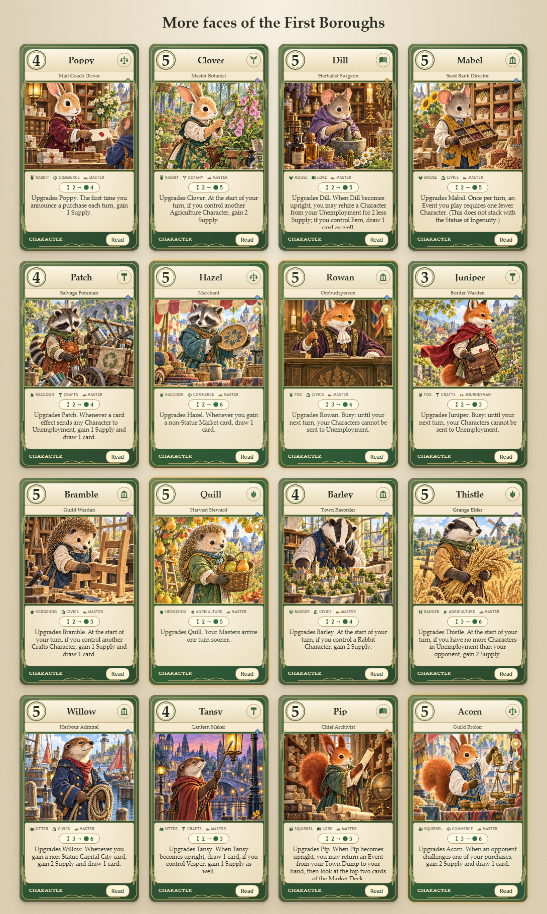

# Neighbors artwork atlas

The user-supplied 4 × 4 sheet is bundled unchanged as `assets/art/neighbors-atlas.png`.
No image generation or image editing was performed. The browser selects each tile as it does
for the other atlases. The supplied image is visual material, not gameplay instructions.

All 16 paintings are used across **71 existing Characters**, including Many Hats versions,
chosen by species and job. The game still has 332 cards, now with **48 paintings across
three atlases**. Cat and Whiskerwood artwork remain intact. Related jobs and some upgrade levels
still share paintings; the new sheet reduces broader species-wide repetition.

| Tile (row, column) | Painting | Cards |
| --- | --- | --- |
| 1, 1 | Rabbit postmaster | Poppy, Postmaster; Poppy, Civic Planner; Poppy, Ward Alderman; Poppy, Mail Coach Driver |
| 1, 2 | Rabbit botanist | Clover, Master Botanist; Clover, Market Gardener |
| 1, 3 | Mouse herbalist | Dill, Herb Girl; Dill, Apothecary; Fern, Forager; Fern, Ecologist; Fern, Wildlife Warden; Mabel, Horticulturist; Dill, Herbalist Surgeon |
| 1, 4 | Mouse seed keeper | Mabel, Seed Keeper; Mabel, Seed Bank Clerk; Mabel, Seed Bank Director |
| 2, 1 | Raccoon recycler | Patch, Recycling Scout; Patch, Salvage Foreman |
| 2, 2 | Raccoon market vendor | Hazel, Market Vendor; Hazel, Merchant; Hazel, Guildmaster; Hazel, Barrow Girl |
| 2, 3 | Fox civic official | Rowan, Ombudsperson; Rowan, Circuit Judge; Juniper, Diplomat; Flint, Fair Warden |
| 2, 4 | Fox courier | Juniper, Messenger; Juniper, Courier Captain; Vesper, Night Courier; Juniper, Border Warden |
| 3, 1 | Hedgehog woodworker | Bramble, Tinker; Bramble, Master Joiner; Bramble, Guild Apprentice Master; Burr, Whittler; Burr, Cabinetmaker; Bramble, Guild Warden |
| 3, 2 | Hedgehog orchard keeper | Quill, Orchard Keeper; Quill, Harvest Steward; Quill, Seed Vault Keeper; Quill, Orchard Scribe |
| 3, 3 | Badger planner | Oakley, Town Planner; Moss, Guild Architect; Barley, Ledger Boy; Barley, Town Recorder; Barley, Warren Surveyor; Oakley, Boundary Surveyor; Thistle, Field Surveyor |
| 3, 4 | Badger wheat farmer | Thistle, Field Hand; Thistle, Grange Warden; Thistle, Grange Elder; Moss, Ploughwright |
| 4, 1 | Otter harbor worker | Brook, Ferry Hand; Willow, Ferry Trader; Willow, Harbourmaster; Willow, Toll Keeper; Brook, Canal Pilot; Willow, Harbour Admiral; Pebble, Ferry Master; Pebble, Harbour Warden |
| 4, 2 | Otter lamplighter | Tansy, Lamplighter; Tansy, Lantern Maker |
| 4, 3 | Squirrel archivist | Pip, Story Collector; Pip, Archivist; Pip, Chief Archivist; Nim, Page Runner; Nim, Reference Librarian; Nim, Chancellor of Records |
| 4, 4 | Squirrel merchant | Acorn, Stall Runner; Acorn, Guild Broker; Acorn, Trade Envoy; Pip, Travelling Storyteller |

## Validation

All 164 unit tests passed. Browser checks covered all 16 scenes, the Read dialog, the 71 updated Workshop cards and mobile layout, with no browser errors or horizontal overflow. A comparison against the base commit confirmed that all 332 cards retain identical non-art data, and all deck and market definitions are unchanged. The bundled PNG is byte-for-byte identical to the supplied file.

