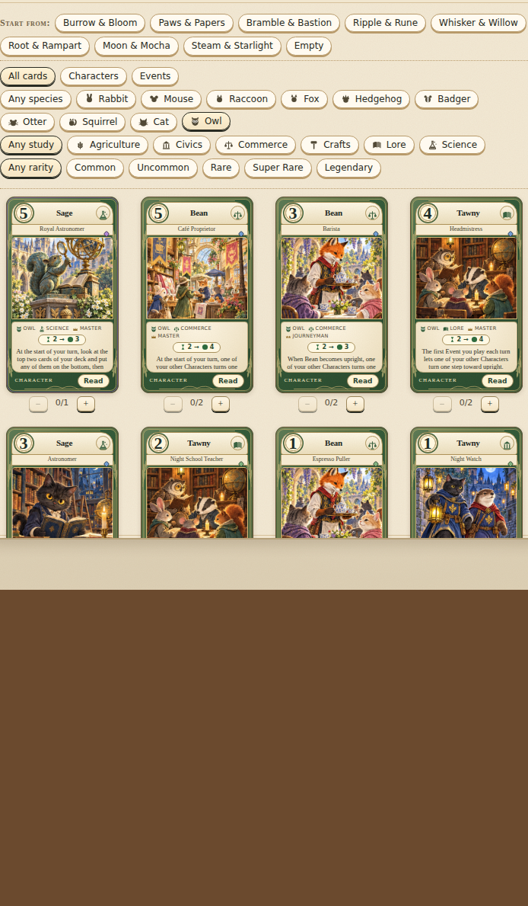
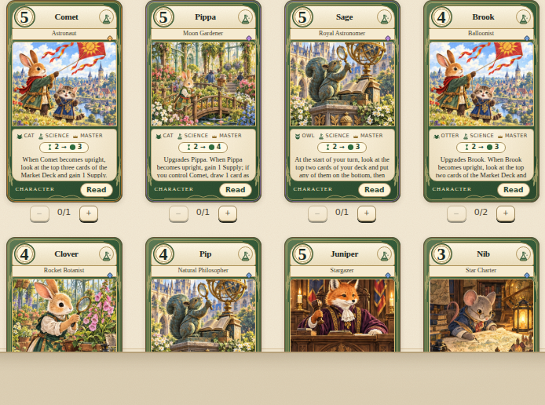

# Night Shift — v0.7.0

> **Archive.** This describes the printed collection, which the game no longer ships. It is kept
> for the design history — the species, studies and rules it introduced are all still in play,
> and the characters it names live on in `spec/maker_card_set.json`. Nothing here is a card list
> you can look up in the game any more.

Night Shift adds **86 cards** for **461 cards** in all, and it is the town after dark. It brings the **Owl**
as the tenth species and **Science** as the sixth study; it gives every one of the **38 named Characters** a
night-shift version; and it adds four new names — Sage the astronomer, Bean the barista, Tawny of the night
school, and **Comet, the Cat who goes to space**. The nine earlier species, five earlier studies, nine
Statues, six printed decks and six Market Decks are preserved, and no earlier card's rules text changed.

## Content

| Addition | Count |
| --- | ---: |
| New versions of existing Characters (one for every name: 18 Apprentices, 18 Journeymen, 14 Masters across the whole expansion) | 38 |
| New Characters: Sage, Bean and Tawny (Owls) and Comet (Cat), three levels each | 12 |
| Events, of which ten support a named Character (15 Instant, 3 Limited) | 18 |
| Market cards | 10 |
| Buildings (The Observatory, The All-Night Café) | 2 |
| Owls for hire (Hoot, Barnaby) | 2 |
| Ordinance (Comet Watch) | 1 |
| On-reveal cards (Meteor Shower, Solar Eclipse, Full Moon) | 3 |
| New 40-card printed decks | 2 |
| New Market Deck | 1 |

### Owls own the night

An Owl is awake when everybody else is asleep, and the charter in `spec/species.json` says so. Owls'
centre of gravity is the **wake-up call**, the **deck scry** and card draw; their hole is that they earn
almost nothing and take no part in a bidding war — an Owl town is wise, awake and poor. The signature verb
is new to the game:

- **`advanceCharacter`, the wake-up call.** A Character turns one step toward upright outside the Ready
  phase: a Master still rotating in at 180° becomes Busy, a Busy Character stands up. It never touches a
  Character mid-shift (a shift keeps its animal Busy for its full delay whoever is hooting at it — moving
  work is Otter territory) and never one pledged into an auction. Bean pulls an espresso and somebody else
  stands up; The All-Night Café does it every turn; Tawny's Headmistress does it whenever you play an Event.
- **`scryDeck`.** Look at the top cards of your own deck and put any of them on the bottom, keeping the
  rest in order. Squirrels reorder their deck; astronomers just know what to look past. Sage, Tawny, the
  hired Barnaby, Inkwell's Star Chart, Lab Notes, Star Chart and the Night Market all use it.

Identity measured after the pass: Owl is the most distinct species in the set (similarity **0.00** to
Badger, and the mean across all 45 pairs fell from 0.29 to **0.25**); its signature appears on six Owl
cards against a floor of two.

### Science

Science is the study of the stars, the boiler and the potato. Twenty-five Characters now hold it, across all
ten species, so a Science deck can be built out of almost anything: Clover the Rocket Botanist, Dill the
Research Chemist, Mortar the Steam Engineer, Vesper the Weather Watcher, Patch the Junkyard Inventor,
Pip the Natural Philosopher, Juniper the Stargazer, Pippa the Moon Gardener, all three of Sage, and Comet.
Science cards do what scientists do — look ahead, read the Market Deck, and draw — and the study has its
own night-sky backdrop and flask icon in the vector art.

### A Cat in space, and the Cat's trick fixed

**Comet** is a Cat: Rocket Mechanic at cost 1, Test Pilot at 3 and **Astronaut** at 5, the expansion's one
Legendary ("From up here the Capital City is a very small market with very small bidding. She waves
anyway."). One Small Step, Comet's Countdown, Thimble the Spacesuit Seamstress, Moss the Rocketwright and
Pippa the Moon Gardener all look for her by name.

Comet's trick is the Cat signature, *Busy, once per game: readies herself*, and building her exposed that the
trick had never worked. The ability was only ever offered from upright, where going Busy and standing straight
back up is nothing; used that way the effect could not even find its own stack. It is now what the charter
always said: **used from the wrong side of upright** — Busy, mid-shift, or a Master still rotating in — once
per game, and readying a working Character this way completes its shift at once. The engine offers it only
from there, the AI values it, and the UI labels it. Mittens, Pippa the Herb Cook and Thimble the Sailmaker
work the same way now. The power model also stopped pricing a once-per-game effect as though it repeated,
which is why those three cards were re-rated (Mittens Legendary → Rare; Pippa, Herb Cook and Thimble,
Sailmaker Rare → Uncommon).

### Everybody gets a night shift

All 38 named Characters take up a new job or a new level: Marmalade bakes at night for the Owls, Sorrel
harvests by lantern, Poppy runs the night mail, Rowan sits as night magistrate, Hazel runs the night market
stall, Nutmeg sells night-blooming flowers, Acorn runs a coffee cart for Owls who tip well, Tansy keeps the
observatory, Pebble runs the night ferry, Thistle keeps an almanac that is one day going to be right, and
Flint — cost 0, so he cannot bid — shouts numbers from the side. Every version of a name still has a
distinct cost, so any cheaper version upgrades into any dearer one.

### Decks and market

**Moon & Mocha** (Owl, Cat; Science, Commerce): the café never closes, the observatory never sleeps, and
somebody has just been launched into space. **Steam & Starlight** (Badger, Owl; Crafts, Science): the boiler
holds and the whole works is up before dawn. Both were built by `scripts/build-decks.mjs`, which gained
`--only <id>,<id>` so that an expansion can add its decks without retuning the six already playtested.

**Night Market** is the seventh Market Deck: all ten new Market cards, both Buildings, both Owls for hire,
Comet Watch, the three new pieces of weather and twenty-two familiar favourites (Night School, Lamplighter's
Round, the Town Clock, Signal Kite, Beacon Hill, Kettle and Cup, Mittens, Bristle, Going Once…). Two of its
on-reveal cards are shocks. **Comet Watch** is a second civic Ordinance in the shape of Works in the Square:
no Statue may be bought while the whole square is looking up, until two animals have steadied the telescopes.

## Artwork and interface

No new paintings were generated. Every Night Shift card names an existing painting with
`art: { atlas, tile }`: the Owls sit in the civic library (the one bundled painting that already had an owl
in it), the night scenes borrow the lantern-lit harvest, the rooftop supper and the night patrol, the
café cards use the tea house, and the astronomy cards use the Statue of Curiosity's armillary sphere and
Inkwell's moonlit library. Underneath, the vector layer gained the Owl (the cover's own owl head, now on a
body), an Owl icon, a Science icon and a night-sky observatory backdrop for Science Characters. The cover
now shows Clover, Sage and Comet and announces the expansion.

Chromium checked the cover, the Deck Workshop with the Owl and Science filters, and the Read view at 1280
and 390 px: no page errors, no failed requests, no horizontal overflow, and the edition line reads
`v0.7.0 · Animal Friends: First Boroughs · 461 cards · 8 decks · 7 Market Decks`.





## Rarity and tooling

Rarity is still computed, never chosen (`node scripts/stamp.mjs`). The expansion reads 27 Common,
35 Uncommon, 20 Rare, 3 Super Rare (Sage the Royal Astronomer, Pippa the Moon Gardener, The Observatory)
and 1 Legendary (Comet, Astronaut); the whole set keeps its pyramid at 211 / 130 / 86 / 23 / 11. The power
creep gate held: Night Shift Characters and Events average **1.06×** the base set (Many Hats is at 1.07×,
the limit is 1.08×). Eleven cards were trimmed during development to get there — mostly Masters whose
2 → 4 shifts became 2 → 3, and a Bean whose Busy woke two friends instead of one.

Two verbs were added to the effect vocabulary (`advanceCharacter`, `scryDeck`) with ratings in
`src/engine/power.js`, pick reasons `advance` and `scry` for agents, AI handling for both (an Owl never
goes Busy to wake nobody; a scry bins only clearly poor cards), and the content test lists them.

## Validation and balance

- 205 unit tests pass, fifteen of them new: the shape of the expansion, the Owl charter and the Science
  study, upgrade lines for the four new names, the wake-up call (Busy → upright, 180° → Busy, never
  mid-shift, never pledged), the scry, the Cat's self-ready from Busy and mid-shift and never from upright,
  Bean and Comet in play, upgrading into a Night Shift version, Comet Watch, the Night Market, both decks
  and the art.
- `node scripts/stamp.mjs --check`, `node scripts/identity.mjs --check` and `node scripts/build-decks.mjs
  --check` all pass.
- 300 randomized games passed conservation, orientation, nonnegative economy and escrow checks, cycling
  all 56 ordered deck pairings across all seven markets.
- 1,120 heuristic-vs-heuristic games over every ordered pairing and market (seed 2026): 100% ended through
  Statue victories, mean length 35.5 turns. Moon & Mocha won 53.2% of its games and Steam & Starlight 53.9%;
  the deck spread across all eight runs from 38.6% (Ripple & Rune) to 58.9% (Burrow & Bloom). Head to head
  in the Night Market over 400 games with seats swapped, Steam & Starlight took 62% — the Badgers' shifts
  out-earn a town of Owls and Cats, which is what both charters say should happen, but it is the widest
  head-to-head of the printed pairs and worth a second look. Night Shift, the Owl Event, was the second
  most played card in the whole set at 0.83 a game. These are preliminary AI results, not a claim of
  tournament balance, and the six earlier decks were not retuned.

Reproduce:

```sh
npm test
node scripts/stamp.mjs --check
node scripts/identity.mjs --check
node scripts/invariants.mjs 300
node scripts/playtest.mjs --games 1120 --decks all --market all --seed 2026
node scripts/playtest.mjs --games 200 --decks mm,ss --market night-market --seed 7
```

## New card catalogue

The following list is a snapshot of the printed set as it stood.

### New Characters

| Card | Cost | Rank | Study | Shift | Rarity | Rules |
| --- | ---: | --- | --- | --- | --- | --- |
| Bean, Espresso Puller (Owl) | 1 | Apprentice | Commerce | 1 → 1 | Uncommon | Busy: one of your other Characters turns one step toward upright. |
| Bean, Barista (Owl) | 3 | Journeyman | Commerce | 2 → 3 | Rare | When Bean becomes upright, one of your other Characters turns one step toward upright. |
| Bean, Café Proprietor (Owl) | 5 | Master | Commerce | 2 → 4 | Rare | At the start of your turn, one of your other Characters turns one step toward upright. |
| Comet, Rocket Mechanic (Cat) | 1 | Apprentice | Crafts | 1 → 1 | Uncommon | When Comet completes a shift, if you control a Science Character, gain 1 Supply. |
| Comet, Test Pilot (Cat) | 3 | Journeyman | Science | 2 → 3 | Uncommon | Busy, once per game: Comet readies herself. |
| Comet, Astronaut (Cat) | 5 | Master | Science | 2 → 3 | Legendary | When Comet becomes upright, look at the top three cards of the Market Deck and gain 1 Supply. Busy, once per game: Comet readies herself. |
| Sage, Telescope Polisher (Owl) | 0 | Apprentice | Science | 1 → 1 | Uncommon | Recruit: look at the top two cards of your deck and put any of them on the bottom. |
| Sage, Astronomer (Owl) | 3 | Journeyman | Science | 2 → 3 | Rare | When Sage becomes upright, look at the top card of the Market Deck, then look at the top two cards of your deck and put any of them on the bottom. |
| Sage, Royal Astronomer (Owl) | 5 | Master | Science | 2 → 3 | Super Rare | At the start of your turn, look at the top two cards of your deck and put any of them on the bottom, then draw 1 card. |
| Tawny, Night Watch (Owl) | 1 | Apprentice | Civics | 1 → 1 | Uncommon | When Tawny becomes upright, look at the top card of your deck; you may put it on the bottom. |
| Tawny, Night School Teacher (Owl) | 2 | Journeyman | Lore | 1 → 2 | Uncommon | Recruit: one of your other Characters turns one step toward upright. |
| Tawny, Headmistress (Owl) | 4 | Master | Lore | 2 → 4 | Rare | The first Event you play each turn lets one of your other Characters turn one step toward upright. |

### New versions of the 38

"Earlier" lists that Character's printed studies before Night Shift.

| Card | Cost | Rank | Study (earlier) | Shift | Rarity | Rules |
| --- | ---: | --- | --- | --- | --- | --- |
| Acorn, Coffee Cart (Squirrel) | 1 | Apprentice | Commerce (Commerce, Crafts, Agriculture) | 1 → 1 | Uncommon | Upgrades Acorn. When Acorn completes a shift, if you control an Owl, gain 1 Supply. |
| Barley, Geologist (Badger) | 2 | Journeyman | Science (Civics, Lore) | 1 → 2 | Rare | Upgrades Barley. Recruit: if you control another Badger, gain 2 Supply. |
| Bramble, Clockmaker (Hedgehog) | 1 | Apprentice | Science (Civics, Crafts) | 1 → 1 | Uncommon | Upgrades Bramble. When Bramble becomes upright, a Character you control cannot be targeted by an opponent until your next turn. |
| Brook, Balloonist (Otter) | 4 | Master | Science (Crafts, Lore, Commerce) | 2 → 3 | Rare | Upgrades Brook. When Brook becomes upright, look at the top two cards of the Market Deck and draw 1 card. |
| Burr, Kite Tester (Hedgehog) | 2 | Journeyman | Science (Crafts, Agriculture) | 1 → 2 | Uncommon | Upgrades Burr. Recruit: if you control another Science Character, draw 1 card. |
| Clover, Rocket Botanist (Rabbit) | 4 | Master | Science (Agriculture, Commerce) | 2 → 3 | Rare | Upgrades Clover. Recruit: you may recruit a Character costing 1 or less from your hand for free; it enters Busy. |
| Copper, Penny Counter (Cat) | 0 | Apprentice | Commerce (Commerce, Civics) | 1 → 1 | Uncommon | Busy, once per game: Copper readies himself. |
| Dill, Research Chemist (Mouse) | 2 | Journeyman | Science (Lore, Civics, Agriculture) | 1 → 2 | Rare | Upgrades Dill. Recruit: you may return an Event from your Town Dump to your hand. |
| Fern, Field Scientist (Mouse) | 1 | Apprentice | Science (Agriculture, Lore) | 1 → 1 | Uncommon | When Fern completes a shift, draw 1 card. |
| Flint, Auctioneer’s Boy (Fox) | 0 | Apprentice | Commerce (Commerce, Civics) | 1 → 1 | Uncommon | Busy: you may pay 1 Supply to raise one of your open bids by 1. |
| Hazel, Night Market Vendor (Raccoon) | 1 | Apprentice | Commerce (Commerce, Crafts) | 1 → 1 | Uncommon | Upgrades Hazel. Recruit: draw 1 card, then discard 1 card. |
| Inkwell, Astronomer (Cat) | 4 | Master | Science (Lore, Commerce) | 2 → 3 | Uncommon | Upgrades Inkwell. When Inkwell completes a shift, look at the top two cards of the Market Deck. Busy, once per game: Inkwell readies himself. |
| Juniper, Stargazer (Fox) | 5 | Master | Science (Civics, Lore, Crafts) | 2 → 3 | Rare | Upgrades Juniper. At the start of your turn, look at the top two cards of the Market Deck; if you control another Science Character, gain 1 Supply as well. |
| Linnet, Night Printer (Rabbit) | 0 | Apprentice | Crafts (Crafts, Lore) | 1 → 1 | Uncommon | When Linnet completes a shift, if you control an Owl, draw 1 card. |
| Mabel, Seed Vault Scientist (Mouse) | 3 | Journeyman | Science (Civics, Agriculture) | 2 → 3 | Uncommon | Upgrades Mabel. The first Event you play each turn that requires Science lets you draw 1 card. |
| Marlow, Lamplighter’s Clerk (Raccoon) | 3 | Journeyman | Civics (Civics, Lore) | 2 → 3 | Rare | Upgrades Marlow. When Marlow becomes upright, you may return an Event from your Town Dump to your hand. |
| Marmalade, Night Baker (Cat) | 0 | Apprentice | Agriculture (Agriculture, Commerce) | 2 → 2 | Uncommon | A patient shift: 2 turns, then 2 Supply. When Marmalade completes a shift, if you control an Owl, gain 1 Supply. |
| Mortar, Steam Engineer (Badger) | 4 | Master | Science (Crafts, Agriculture) | 2 → 4 | Rare | Upgrades Mortar. When Mortar becomes upright, your town braces: the next shared shock passes it over. |
| Moss, Rocketwright (Badger) | 4 | Master | Crafts (Crafts, Agriculture) | 2 → 3 | Rare | Upgrades Moss. When Moss becomes upright, if you control Comet, gain 2 Supply. |
| Nib, Star Charter (Mouse) | 3 | Journeyman | Science (Lore) | 2 → 3 | Rare | Upgrades Nib. Busy: the next Event you play requires one fewer Character. |
| Nim, Night Archivist (Squirrel) | 2 | Journeyman | Lore (Lore, Civics) | 1 → 2 | Rare | Upgrades Nim. When Nim becomes upright, look at the top two cards of your deck and put them back in any order. |
| Nutmeg, Night-Bloom Florist (Squirrel) | 3 | Journeyman | Agriculture (Commerce, Agriculture) | 2 → 3 | Uncommon | Upgrades Nutmeg. When Nutmeg completes a shift, put 1 Supply by on Nutmeg. |
| Oakley, Bridge Engineer (Badger) | 4 | Master | Science (Crafts, Civics, Lore) | 2 → 4 | Rare | Upgrades Oakley. At the start of your turn, if you control a Crafts Character, gain 1 Supply. |
| Patch, Junkyard Inventor (Raccoon) | 2 | Journeyman | Science (Civics, Commerce, Crafts) | 1 → 1 | Uncommon | Upgrades Patch. Busy: take a Market card from the City Dump and gain it. |
| Pebble, Night Ferry (Otter) | 0 | Apprentice | Commerce (Civics, Commerce) | 1 → 1 | Uncommon | Busy: move a shift from one of your Characters to another. |
| Pip, Natural Philosopher (Squirrel) | 4 | Master | Science (Lore, Commerce) | 2 → 3 | Rare | Upgrades Pip. When Pip becomes upright, look at the top three cards of your deck and put them back in any order, then put 1 Supply by on Pip. |
| Pippa, Moon Gardener (Cat) | 5 | Master | Science (Agriculture) | 2 → 4 | Super Rare | Upgrades Pippa. When Pippa becomes upright, gain 1 Supply; if you control Comet, draw 1 card as well. |
| Poppy, Night Mail (Rabbit) | 2 | Journeyman | Civics (Commerce, Civics) | 2 → 2 | Uncommon | Upgrades Poppy. When Poppy becomes upright, gain 1 Supply. |
| Quill, Night Gardener (Hedgehog) | 0 | Apprentice | Agriculture (Agriculture, Lore) | 2 → 2 | Uncommon | A patient shift: 2 turns, then 2 Supply. Recruit: your next rehire costs 1 less Supply. |
| Rowan, Night Magistrate (Fox) | 1 | Apprentice | Civics (Civics, Commerce, Crafts) | 1 → 1 | Uncommon | When Rowan starts a shift, look at the top card of the Market Deck. |
| Russet, Coffee Roaster (Fox) | 3 | Journeyman | Commerce (Civics, Commerce) | 2 → 3 | Rare | Upgrades Russet. Busy: gain 1 Supply, then you may pay 2 Supply to raise one of your open bids by 2. |
| Sorrel, Night Harvester (Rabbit) | 3 | Journeyman | Agriculture (Agriculture, Civics) | 2 → 2 | Rare | Upgrades Sorrel. Recruit: you may recruit a Character costing 1 or less from your hand for free; it enters Busy. |
| Tansy, Observatory Keeper (Otter) | 0 | Apprentice | Lore (Civics, Lore, Crafts) | 1 → 1 | Uncommon | Recruit: choose another Character you control; it becomes upright at the start of your next turn. |
| Thimble, Spacesuit Seamstress (Cat) | 1 | Apprentice | Science (Crafts, Commerce) | 1 → 1 | Uncommon | Upgrades Thimble. Recruit: if you control Comet, draw 1 card. |
| Thistle, Almanac Keeper (Badger) | 1 | Apprentice | Lore (Agriculture, Civics) | 1 → 1 | Uncommon | Busy: your town braces: the next shared shock passes it over. |
| Velvet, Registrar of Stars (Cat) | 4 | Master | Science (Civics, Lore) | 2 → 4 | Uncommon | Upgrades Velvet. When you announce a purchase with Velvet, draw 1 card. |
| Vesper, Weather Watcher (Fox) | 2 | Journeyman | Science (Lore, Commerce) | 1 → 2 | Uncommon | Upgrades Vesper. When Vesper starts a shift, look at the top two cards of the Market Deck. |
| Willow, Tide Reckoner (Otter) | 3 | Journeyman | Science (Civics, Commerce) | 2 → 3 | Rare | Upgrades Willow. When Willow becomes upright, another Character you control becomes upright at the start of your next turn. |

### Events

| Card | Requires | Rarity | Rules |
| --- | --- | --- | --- |
| Bean’s Coffee Break | Bean | Common | Requires Bean. Two of your other Characters each turn one step toward upright. |
| Cat Nap | Cat | Common | Requires a Cat. Choose another Character you control; it becomes upright at the start of your next turn. Then gain 2 Supply. |
| Clover’s Potato Experiment | Clover + Agriculture | Rare | Requires Clover and an Agriculture Character. Gain 3 Supply, then you may recruit a Character costing 1 or less from your hand for free; it enters Busy. |
| Comet’s Countdown (Limited 3) | Comet | Common | Requires Comet. Limited 3: at the start of your turn, gain 1 Supply. |
| Double Espresso | Commerce | Common | Requires a Commerce Character. Ready one of your Characters. |
| Eureka! | 2× Science | Uncommon | Requires two Science Characters. Gain 4 Supply and draw 1 card. |
| Everybody Looks Up | Science | Common | Requires a Science Character. Your opponent puts a card from their hand on top of their deck, then you draw 1 card. |
| Hoot and Holler | Owl + Cat | Uncommon | Requires an Owl and a Cat. Gain 3 Supply and draw 1 card. |
| Inkwell’s Star Chart | Inkwell | Common | Requires Inkwell. Look at the top three cards of your deck and put any of them on the bottom, then draw 1 card. |
| Lab Notes (Limited 2) | Science | Common | Requires a Science Character. Limited 2: at the start of your turn, look at the top two cards of your deck and put any of them on the bottom, then gain 1 Supply. |
| Mortar’s Boiler Test | Mortar | Common | Requires Mortar. Gain 2 Supply. Your town braces: the next shared shock passes it over. |
| Night Shift | Owl | Common | Requires an Owl. One of your Characters turns one step toward upright, then draw 1 card. |
| One Small Step | Comet + Science | Uncommon | Requires Comet and a Science Character. Gain 5 Supply and draw 1 card. |
| Patch’s Contraption | Patch | Common | Requires Patch. Take a Market card from the City Dump and gain it. |
| Sage’s Star Party | Sage + Science | Common | Requires Sage and a Science Character. Draw 2 cards, then look at the top two cards of the Market Deck. |
| Stargazing | Lore | Common | Requires a Lore Character. Draw 1 card, then look at the top three cards of your deck and put any of them on the bottom. |
| Tawny’s Night Class (Limited 2) | Tawny | Common | Requires Tawny. Limited 2: at the start of your turn, one of your Characters turns one step toward upright. |
| Vesper’s Forecast | Vesper | Common | Requires Vesper. Look at the top three cards of the Market Deck, then gain 2 Supply. |

### Market cards, Buildings, hires, the Ordinance and the weather

| Card | Type | Cost | Rarity | Rules |
| --- | --- | ---: | --- | --- |
| Star Chart | Market | 1 | Common | Look at the top three cards of your deck and put any of them on the bottom. |
| Coffee Round | Market | 2 | Common | One of your Characters turns one step toward upright, then draw 1 card. |
| Owl Post | Market | 2 | Common | Draw 1 card and gain 1 Supply. |
| Telescope Hire | Market | 2 | Common | Look at the top three cards of the Market Deck, then draw 1 card. |
| Night Market | Market | 3 | Common | Gain 2 Supply, then look at the top two cards of your deck and put any of them on the bottom. |
| Rocket Fuel | Market | 3 | Common | At your next Ready, your Characters advance one extra orientation step. Gain 1 Supply. |
| Weather Balloon | Market | 3 | Common | Look at the top two cards of the Market Deck and gain 2 Supply. |
| Science Fair | Market | 4 | Common | Draw 2 cards. Your next recruit costs 2 less Supply. |
| The Late Shift | Market | 4 | Common | Two of your Characters each turn one step toward upright, then gain 1 Supply. |
| Moon Landing Parade | Market | 5 | Uncommon | Gain 3 Supply, draw 1 card, and one of your Characters turns one step toward upright. |
| The All-Night Café | Building | 7 | Uncommon | At the start of your turn, one of your Characters turns one step toward upright. |
| The Observatory | Building | 8 | Super Rare | At the start of your turn, look at the top two cards of the Market Deck and draw 1 card. |
| Hoot (Owl · Civics) | Hired animal | 2 | Uncommon | Hired from the Capital City; enters Busy. Busy: one of your other Characters turns one step toward upright. |
| Barnaby (Owl · Commerce) | Hired animal | 4 | Uncommon | Hired from the Capital City; enters Busy. At the start of your turn, look at the top two cards of your deck and put any of them on the bottom. |
| Comet Watch | Ordinance | — | Common | While this is displayed, no Statue may be bought: the whole square is looking up. Either Mayor may put an upright Character to work steadying the telescopes; when two have been put to work, between them or by one Mayor alone, the comet passes and this leaves the Capital City. |
| Full Moon | On reveal | — | Common | The Mayor with fewer Statues readies a Character and gains 2 Supply. |
| Meteor Shower | On reveal | — | Common | Both Mayors draw 1 card and gain 1 Supply. |
| Solar Eclipse | On reveal | — | Common | At each Mayor’s next Ready, their Characters do not advance: everybody has stopped to look up. |

### Decks

**Moon & Mocha** — Owls and Cats of Science and Commerce: the café never closes, the observatory never sleeps, and somebody has just been launched into space.

2× Copper, Penny Counter ✦ · 2× Copper, Scale Polisher · 2× Bean, Espresso Puller ✦ · 2× Inkwell, Ledger Scribe · 2× Marmalade, Market Baker · 2× Bean, Barista ✦ · 2× Sage, Astronomer ✦ · 1× Comet, Test Pilot ✦ · 3× Inkwell, Astronomer ✦ · 1× Comet, Astronaut ✦ · 1× Pippa, Moon Gardener ✦ · 2× Windowsill Garden · 2× Cat Nap ✦ · 2× Tea and Tales · 2× Rooftop Supper · 2× River Market · 2× Tidy Books · 2× Fair Measure · 2× Arcade Fair · 2× Market Day · 1× Open Ledger · 1× Sage, Royal Astronomer ✦

**Steam & Starlight** — Badgers and Owls of Crafts and Science: the boiler holds, the telescope is pointed the right way, and the whole works is up and running before dawn.

2× Sage, Telescope Polisher ✦ · 2× Barley, Ledger Boy · 2× Bean, Espresso Puller ✦ · 1× Oakley, Stonemason · 2× Barley, Geologist ✦ · 2× Moss, Toolsmith · 2× Moss, Guild Architect · 2× Mortar, Watermill Mechanic · 1× Sage, Astronomer ✦ · 2× Mortar, Steam Engineer ✦ · 2× Oakley, Bridge Engineer ✦ · 1× Sage, Royal Astronomer ✦ · 1× Moss, Bridgewright · 2× Mended Fences · 2× Lab Notes ✦ · 2× Everybody Looks Up ✦ · 2× Toolbox Trade · 2× Spare Parts · 2× Patchwork Gift · 1× Tool Lending Day · 2× Sewing Circle · 2× Night Shift ✦ · 1× Mortar, Master Millwright
