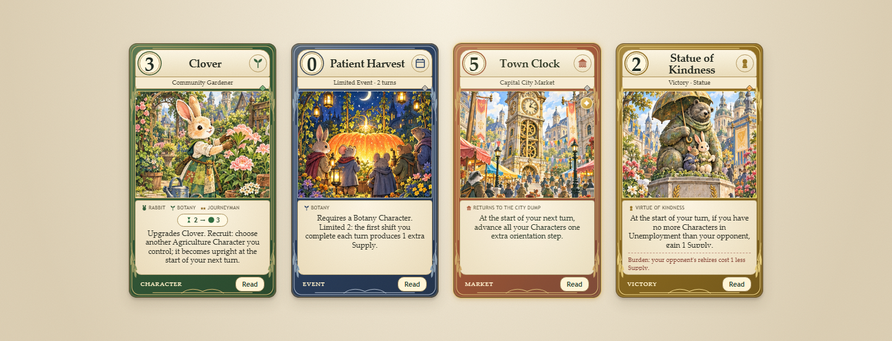

# Painted storybook edition

This records the original 208-card visual pass. The v0.3.0 [Whiskerwood expansion](WHISKERWOOD.md)
adds 52 cards and 16 more paintings, for 260 cards and 32 paintings overall.

The September 12, 2026 user-supplied four-card reference guides this visual update: lush storybook
paintings, parchment panels, botanical ornament and type-specific frames. Text on that reference is
visual reference material, not a request to replace the live card set or change the rules.

## Implementation

- `assets/art/boroughs-atlas.png`: original generated 4 × 4 atlas, bundled unchanged.
- `src/ui/painted-art.js`: stable scene selection and ornamental vector frames.
- `src/ui/art.js`: wraps the existing per-card SVG scenes with painted artwork; failed image loads
  leave the original vectors visible. New unknown species also keep their vector art.
- `src/ui/storybook.css`: card frames, typography, paper surfaces, responsive sizes and reduced motion.
- `src/ui/render.js`: live names, costs, jobs, traits, shifts, rules and burdens, plus a separate native
  dialog for reading. Opening the reader does not resolve an engine decision. It supports Escape,
  modal keyboard focus, and returning focus to the invoking button when that button still exists.

The compact table faces prioritize artwork and can shorten dense text. The Read dialog expands to
fit full text, including burdens and flavor. Statues retain their actual boon and burden even where
the concept sheet had different wording. Rarity gems, foil treatment, orientation and action states
remain present.

## Coverage and limitations

The 208 cards share 16 painted archetypes. Each of the eight species has its own painting; jobs and
upgrade levels share that species scene. Events and Market cards use thematic scenes. All nine Statues
currently share the Kindness monument painting. Unique art for every individual card is future work.

| Row | Tile 1 | Tile 2 | Tile 3 | Tile 4 |
| --- | --- | --- | --- | --- |
| 1 | Rabbit garden | Mouse library | Fox market | Raccoon post office |
| 2 | Hedgehog greenhouse | Badger workshop | Otter canal | Squirrel orchard |
| 3 | Patient Harvest | Seed exchange | Civic library | Winter village |
| 4 | Town Clock | Capital City market | Conservatory | Kindness monument |

The artwork was created with the built-in image-generation tool using the supplied image as style
reference. Canva lookup was attempted but the connection required reauthentication; no Canva design
was created or changed. The full generation prompt is in [ART_PROMPT.txt](ART_PROMPT.txt).

## Validation

- 142 existing unit tests passed (plus 30 suite containers).
- Full-game smoke run completed with a winner.
- 200 randomized games across four Market Decks passed card-conservation checks.
- Chromium: desktop (1440 px), tablet (768 px), and mobile (390 px); no page errors, failed asset
  requests, or horizontal document overflow in checked game and workshop layouts.
- Started a seeded game, chose Supply, and recruited a Character through the existing action UI.
- Checked the Deck Workshop's 120 player-card faces and opened its card reader.
- Checked complete rules and burden layout for all 208 definitions in the reader at mobile width.
- Verified Escape dismissal and keyboard focus restoration. Native screen-reader testing was not run.

