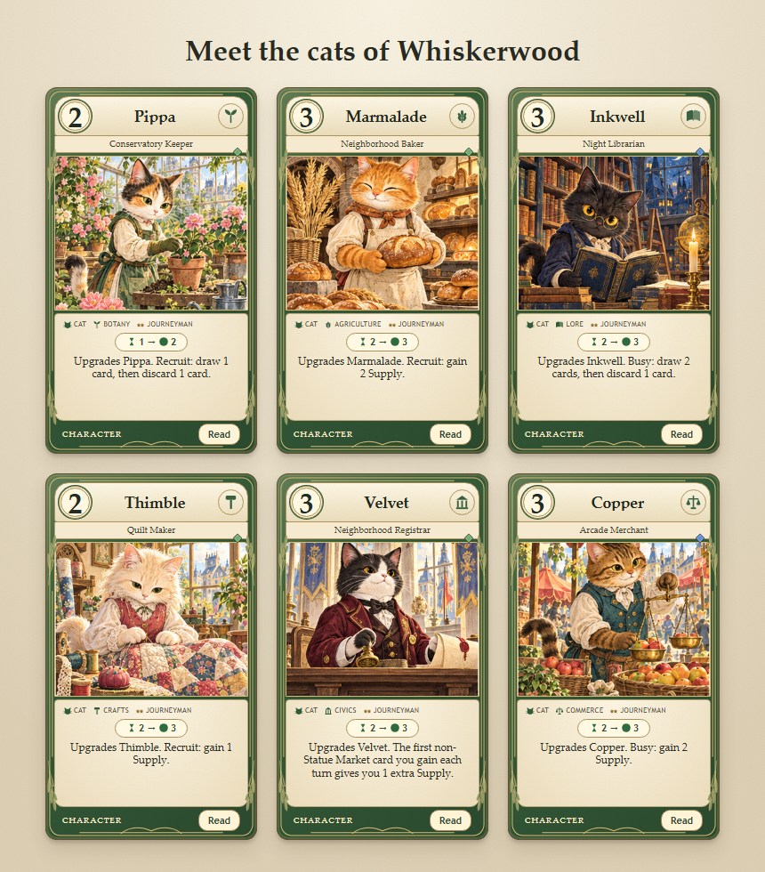

# Whiskerwood — v0.3.0

> **Archive.** This describes the printed collection, which the game no longer ships. It is kept
> for the design history — the species, studies and rules it introduced are all still in play,
> and the characters it names live on in `spec/maker_card_set.json`. Nothing here is a card list
> you can look up in the game any more.

Whiskerwood adds **52 cards**, exactly 25% of the previous 208-card catalogue, for **260 cards**.
It adds **Cat** as the ninth species and uses the existing six studies and rules vocabulary.
The original 208 definitions, six starter decks, four Market Decks and nine Statues are preserved.

## Content

| Addition | Count |
| --- | ---: |
| Cat Characters: six named families with three levels each | 18 |
| Other new Characters | 6 |
| Events (12 Instant, 6 Limited) | 18 |
| Market cards | 10 |
| New paintings | 16 |
| New 30-card starter decks | 2 |
| New Market Deck | 1 |

Pippa is a calico botanist; Marmalade is a ginger baker; Inkwell is a black-furred librarian;
Thimble is a cream-furred tailor; Velvet is a tuxedo civic clerk; Copper is a tabby merchant.
Each has Apprentice, Journeyman and Master versions with distinct costs and abilities.
Linnet (Rabbit), Nib (Mouse), Russet (Fox), Mortar (Badger), Pebble (Otter) and Nutmeg (Squirrel)
join them as new neighbors.

**Whisker & Willow** brings Cats together with Rabbit, Badger and Squirrel workers in Botany,
Agriculture and Crafts. It builds its economy through shifts and cooperative Events.
**Velvet & Ledger** mixes Cats, Mouse, Fox and Otter workers in Lore, Civics and Commerce,
with card selection, hiring discounts and market rewards. Each deck has 18 Characters and 12 Events,
with copy counts checked against computed rarity.

Choose **Whiskerwood Fair** at setup to play with all ten new Market cards, six familiar Market cards
and the original nine Statues. It contains no Disruptions and has the same 25-card size as other
Market Decks. New cards can also be mixed into custom player decks through the Deck Workshop.
Its Cat filter finds 18 Cat Characters and six Events with explicit Cat requirements.

## Artwork and interface

The built-in image-generation tool created `assets/art/whiskerwood-atlas.png`, an additional
4 × 4 atlas. It has twelve distinct character portraits and four neighborhood scenes. The three
levels of each Cat share that Cat's portrait; related Events and Markets reuse appropriate scenes.
Together with the original atlas, the game now has 32 paintings. No external image service is
required at play time. The complete prompt is in [WHISKERWOOD_ART_PROMPT.txt](WHISKERWOOD_ART_PROMPT.txt).
The prompt's provisional names Tansy and Barley became Thimble and Mortar to avoid colliding with
existing Characters; no names or rules were baked into the paintings.

Card metadata uses `expansion: "AF-WHISKER-01"` and `art: { atlas: "whiskerwood", tile: 0..15 }`.
The renderer only resolves bundled atlas names, never arbitrary URLs from card data. Original art
selection is unchanged. Cat icons and vector fallback art are included for the Workshop and cards.

The cover previews Cats and identifies the new expansion. The full-card Read view remains available
on every interactive face. Browser checks also exposed a pre-existing Instant-pace jitter: an idle
animation was repeating at 1% duration. Instant pace now disables CSS animations and transitions,
so clickable cards and their Read controls stay still.



## Validation and balance

- 151 unit tests passed, including nine expansion tests for species requirements, distinct workers,
  Cat upgrades, conditional/once-per-turn rewards, Limited Event expiry, new market inclusion,
  independent one-use discounts and art coverage.
- 280 randomized games passed conservation, orientation, nonnegative economy and escrow checks,
  cycling all 56 ordered deck pairings across all five markets.
- 560 heuristic-vs-heuristic games ended through Statue victories; none hit the turn cap.
- Each new deck appeared in 140 games, split evenly between seats. Whisker & Willow won 62 (44.3%);
  Velvet & Ledger won 59 (42.1%). These are preliminary AI results, not a claim of tournament balance.
  Early Velvet & Ledger economy was improved before this final batch, and rarity/copy limits were
  recalculated afterward. The six original decks were not retuned.
- Chromium checked the 260-card edition, new-deck setup, Whiskerwood Fair selection, Cat recruiting,
  the Cat Workshop filter and full rules/burden layout for all 260 cards. At 390 px and 768 px there
  was no horizontal document overflow. No browser errors or failed asset requests were observed.
- Compared original definitions and deck lists against the prior commit; all original content is unchanged.

Reproduce the rules and simulation checks:

```sh
npm test
node scripts/invariants.mjs 280
node scripts/playtest.mjs --games 560 --decks all --market all
```

## New card catalogue

The following list is a snapshot of the printed set as it stood.

### Character cards

| Card | Cost | Rarity | Rules |
| --- | ---: | --- | --- |
| Copper, Scale Polisher (Cat · Commerce; shift 1 → 2) | 1 | Rare | Recruit: gain 1 Supply. |
| Copper, Arcade Merchant (Cat · Commerce; shift 2 → 3) | 3 | Rare | Upgrades Copper. Busy: gain 2 Supply. |
| Copper, Market Steward (Cat · Commerce; shift 2 → 4) | 5 | Uncommon | Upgrades Copper. The first time Copper announces a purchase each turn, draw 1 card. |
| Inkwell, Bookmark Keeper (Cat · Lore; shift 2 → 3) | 1 | Uncommon | Recruit: draw 1 card, then discard 1 card. |
| Inkwell, Night Librarian (Cat · Lore; shift 2 → 3) | 3 | Rare | Upgrades Inkwell. Busy: draw 2 cards, then discard 1 card. |
| Inkwell, Keeper of Stories (Cat · Lore; shift 2 → 4) | 5 | Uncommon | Upgrades Inkwell. The first Event you play each turn that requires Lore lets you draw 1 card. |
| Linnet, Bookbinder (Rabbit · Crafts; shift 1 → 1) | 1 | Uncommon | Recruit: draw 1 card. |
| Marmalade, Dough Kneader (Cat · Agriculture; shift 1 → 2) | 1 | Rare | A steady shift: 1 turn, then 2 Supply. |
| Marmalade, Neighborhood Baker (Cat · Agriculture; shift 2 → 3) | 3 | Uncommon | Upgrades Marmalade. Recruit: gain 2 Supply. |
| Marmalade, Harvest Head Baker (Cat · Agriculture; shift 2 → 5) | 5 | Rare | Upgrades Marmalade. The first time Marmalade completes a shift each turn, gain 1 extra Supply. |
| Mortar, Watermill Mechanic (Badger · Crafts; shift 2 → 3) | 3 | Super Rare | Busy: gain 1 Supply and draw 1 card. |
| Nib, Canal Cartographer (Mouse · Lore; shift 2 → 3) | 2 | Uncommon | Recruit: draw 1 card, then discard 1 card. |
| Nutmeg, Bouquet Weaver (Squirrel · Botany; shift 1 → 2) | 2 | Uncommon | Recruit: gain 1 Supply. |
| Pebble, Bridge Courier (Otter · Civics; shift 1 → 1) | 1 | Uncommon | Recruit: your next recruit costs 1 less Supply. |
| Pippa, Potting Helper (Cat · Botany; shift 2 → 2) | 0 | Uncommon | A patient shift: 2 turns, then 2 Supply. |
| Pippa, Conservatory Keeper (Cat · Botany; shift 1 → 2) | 2 | Uncommon | Upgrades Pippa. Recruit: draw 1 card, then discard 1 card. |
| Pippa, Glasshouse Curator (Cat · Botany; shift 2 → 4) | 4 | Uncommon | Upgrades Pippa. The first Event you play each turn that requires Botany gives you 1 Supply. |
| Russet, Tea Trader (Fox · Commerce; shift 1 → 2) | 2 | Uncommon | Recruit: your next rehire costs 1 less Supply. |
| Thimble, Thread Sorter (Cat · Crafts; shift 1 → 1) | 0 | Common | A small shift: 1 turn, then 1 Supply. |
| Thimble, Quilt Maker (Cat · Crafts; shift 2 → 3) | 2 | Uncommon | Upgrades Thimble. Recruit: gain 1 Supply. |
| Thimble, Master of Mending (Cat · Crafts; shift 2 → 4) | 4 | Rare | Upgrades Thimble. Busy: choose another Character you control; it becomes upright at the start of your next turn. |
| Velvet, Petition Runner (Cat · Civics; shift 1 → 2) | 1 | Rare | Recruit: draw 1 card, then discard 1 card. |
| Velvet, Neighborhood Registrar (Cat · Civics; shift 2 → 3) | 3 | Uncommon | Upgrades Velvet. The first non-Statue Market card you gain each turn gives you 1 extra Supply. |
| Velvet, Guild Speaker (Cat · Civics; shift 2 → 4) | 5 | Uncommon | Upgrades Velvet. While Velvet is upright, your first bid each turn counts as 1 higher. |

### Event cards

| Card | Cost | Rarity | Rules |
| --- | ---: | --- | --- |
| A Shared Book | 0 | Common | Requires a Cat and a Mouse. Draw 3 cards, then discard 1 card. |
| Arcade Fair | 0 | Common | Requires Commerce. Limited 2: the first non-Statue Market card you gain each turn gives you 2 extra Supply. |
| Blossom Week | 0 | Common | Requires Botany. Limited 2: the first Event you play each turn that requires Botany lets you draw 1 card. |
| Courier Shortcut | 0 | Common | Requires Civics. Choose a Character you control to become upright at the start of your next turn, then draw 1 card. |
| Fair Measure | 0 | Common | Requires Commerce. Gain 2 Supply. Your next recruit costs 1 less Supply. |
| Fresh Batch | 0 | Common | Requires Agriculture. Gain 3 Supply. |
| Garden Helpers | 0 | Common | Requires Botany. You may ready one of your Characters. |
| Guild Open Day | 0 | Uncommon | Requires two Cats. Gain 3 Supply and draw 1 card. |
| Midnight Index | 0 | Common | Requires Lore. Draw 2 cards, then discard 1 card. |
| Open Petition | 0 | Common | Requires Civics. Draw 1 card. Your next rehire costs 2 less Supply. |
| Patchwork Gift | 0 | Common | Requires Crafts. You may rehire a Character for 1 less Supply, then gain 1 Supply. |
| Reading Lanterns | 0 | Common | Requires Lore. Limited 2: at the start of your turn, draw 1 card. |
| Rooftop Supper | 0 | Common | Requires a Cat. Limited 2: the first shift you complete each turn gives you 1 extra Supply. |
| Sewing Circle | 0 | Common | Requires Crafts. Limited 2: at the start of your turn, gain 1 Supply. |
| Tea and Tales | 0 | Common | Requires a Cat. Draw 2 cards. |
| Thread Exchange | 0 | Uncommon | Requires a Cat and a Rabbit. Gain 4 Supply. |
| Welcome Committee | 0 | Common | Requires Civics. Limited 2: the first shift you start each turn gives you 1 Supply. |
| Windowsill Garden | 0 | Common | Requires a Cat. Gain 2 Supply and draw 1 card. |

### Market cards

| Card | Cost | Rarity | Rules |
| --- | ---: | --- | --- |
| Blossom Court | 4 | Common | At the start of your next turn, advance all your Characters one extra orientation step. |
| Bookbinders' Arcade | 3 | Common | Draw 3 cards, then discard 1 card. |
| Canal Map Room | 2 | Common | Draw 2 cards. |
| Community Oven | 2 | Uncommon | Gain 4 Supply. |
| Fairweight Scales | 2 | Common | Your next recruit and your next rehire each cost 1 less Supply. |
| Glasshouse Walk | 3 | Common | You may ready one of your Characters, then gain 1 Supply. |
| Lantern Terrace | 3 | Common | Gain 2 Supply and draw 1 card. |
| Tailors' Cooperative | 2 | Common | You may rehire a Character for 2 less Supply. |
| Tea House Arcade | 3 | Common | Gain 3 Supply. Your opponent gains 1 Supply. |
| Whiskerwood Guildhall | 4 | Common | Draw 1 card. Your next recruit costs 2 less Supply. |
